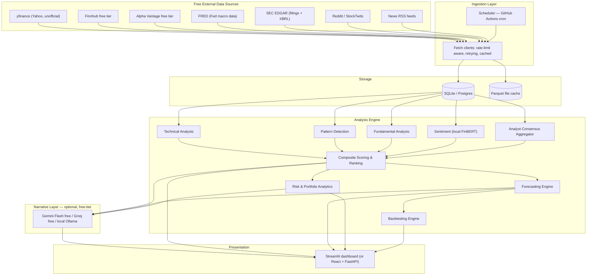
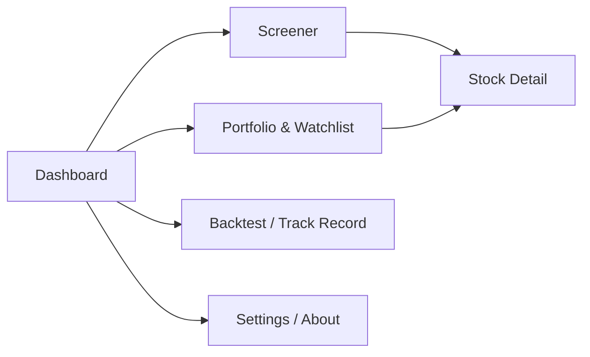
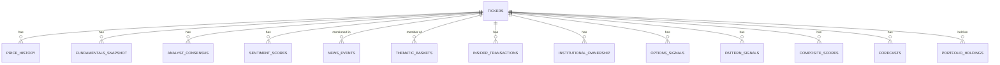

# QuantPulse — Full Project Plan
### An open-source, zero-cost stock research & portfolio-management engine

> Working name: **QuantPulse**. Other options if you want to rename it: `Alphalytics`, `MarketMind`, `TickerSage`, `Argus Quant`. Everything below uses QuantPulse as a placeholder — a find-and-replace is all it takes to rename.

**Status:** Planning document (no code written yet)
**Author:** You + Claude
**Last updated:** July 21, 2026

---

## Table of Contents

1. [Elevator Pitch & Goals](#1-elevator-pitch--goals)
2. [Scope: What This Is and Isn't](#2-scope-what-this-is-and-isnt)
3. [High-Level Architecture](#3-high-level-architecture)
4. [Key Architecture Decisions (mini-ADRs)](#4-key-architecture-decisions-mini-adrs)
5. [Data Sources Catalog](#5-data-sources-catalog)
6. [Data Pipeline & Storage Design](#6-data-pipeline--storage-design)
7. [The Analysis Engine (the real "brain")](#7-the-analysis-engine-the-real-brain)
8. [Function 1 — Stock Screener & Recommendation Engine](#8-function-1--stock-screener--recommendation-engine)
9. [Function 2 — Portfolio Manager](#9-function-2--portfolio-manager)
10. [Bonus Features You Didn't Ask For (But Should Want)](#10-bonus-features-you-didnt-ask-for-but-should-want)
11. [LLM Integration Strategy (free tier only)](#11-llm-integration-strategy-free-tier-only)
12. [UI/UX Design](#12-uiux-design)
13. [Database Schema](#13-database-schema)
14. [Project Folder Structure](#14-project-folder-structure)
15. [Development Roadmap & Milestones](#15-development-roadmap--milestones)
16. [Testing Strategy](#16-testing-strategy)
17. [CI/CD & Free Deployment](#17-cicd--free-deployment)
18. [Security & Secrets](#18-security--secrets)
19. [Legal, Ethical & Compliance Notes](#19-legal-ethical--compliance-notes)
20. [How to Present This on GitHub](#20-how-to-present-this-on-github)
21. [Model & Effort Assignment Per Task](#21-model--effort-assignment-per-task)
22. [Methodological Pitfalls to Avoid](#22-methodological-pitfalls-to-avoid)
23. [Investor Profiles & Personas](#23-investor-profiles--personas)
24. [Smart Money Signals (Insiders, Institutions, Options Positioning & Short Interest)](#24-smart-money-signals-insiders-institutions-options-positioning--short-interest)
25. [Live Demo, Sessions & Data Persistence](#25-live-demo-sessions--data-persistence)
26. [Usage Guide — Who This Is For and How Often to Check It](#26-usage-guide--who-this-is-for-and-how-often-to-check-it)
27. [Portfolio Optimization & Rebalancing Math](#27-portfolio-optimization--rebalancing-math)
28. [Extended Macro & Cross-Asset Signals](#28-extended-macro--cross-asset-signals)
29. [Engineering Rigor & Operational Maturity](#29-engineering-rigor--operational-maturity)
30. [Portfolio Bookkeeping Edge Cases](#30-portfolio-bookkeeping-edge-cases)
31. [Further UX & Presentation Polish](#31-further-ux--presentation-polish)
32. [Future Extensions](#32-future-extensions)
33. [Appendix: Quickstart Checklist](#33-appendix-quickstart-checklist)

---

## 1. Elevator Pitch & Goals

**QuantPulse is a self-hosted, entirely free research assistant that (a) screens the market and tells you which stocks look statistically attractive right now, with a Strong-Buy→Strong-Sell rating, and (b) watches a portfolio you give it and tells you what to add, trim, hold, or cut** — all backed by transparent, from-scratch quantitative analysis rather than a black-box LLM call.

Design principles that shape every decision below:

- **$0 recurring cost.** Every data source, model, hosting option, and library is free-tier or fully open-source. No credit card should ever be required to run this project.
- **The math does the thinking; the LLM does the talking.** Ranking, scoring, and forecasting are done with real statistics and ML you control and can explain. A free-tier LLM is used only as a narration/explanation/chat layer on top of numbers that already exist — never as the source of the numbers themselves. This is both more honest and works around free-tier LLM rate limits (you'd blow through a free quota in minutes if the LLM had to reason about hundreds of tickers).
- **Honest about uncertainty.** Nothing here claims to "beat the market." Forecasts are probabilistic, backtested against a naive baseline and a buy-and-hold benchmark, and shown with confidence intervals — because that's both the ethical way to present this and the technically credible way (an employer reviewing this repo will trust it *more* for including this).
- **News matters at three levels, not one.** A stock's price is pushed by news about that specific company, by news about its industry (AI regulation, tariffs on a sector, a competitor's earnings), and by news about the market as a whole (Fed decisions, geopolitics). Section 7.3 builds a dedicated module for all three tiers — this isn't a bolt-on, it's a first-class weighted input to the ranking (Section 7.5).
- **Built to be shown off.** Clean architecture, tests, CI, a live demo link, and documentation good enough that a stranger can understand it in five minutes.

---

## 2. Scope: What This Is and Isn't

**In scope (the 2 required functions, expanded):**

| # | Function | One-line description |
|---|---|---|
| 1 | **Screener & Recommendation Engine** | Ranks a configurable universe of stocks (e.g. S&P 500) end-to-end using technical, fundamental, sentiment, and analyst signals, and outputs a Strong Buy → Strong Sell rating plus a probabilistic price forecast for each. |
| 2 | **Portfolio Manager** | You give it your holdings (manual entry or CSV import); it analyzes each one, computes portfolio-level risk/diversification metrics, and gives per-holding Add/Trim/Hold/Sell guidance plus rebalancing suggestions. |

**Explicitly out of scope (and why):**

- **No live brokerage connection or real trade execution.** This is an analysis tool, not a trading bot. Real brokerage APIs (Plaid, live Schwab/IBKR APIs) either cost money, require business onboarding, or both — and wiring up real order execution is a much bigger liability surface than a portfolio project needs. Paper (fake-money) trading is in scope as a bonus feature (Section 10).
- **No guarantee of predictive accuracy.** Nobody has solved stock prediction. The value of this project is the engineering (data pipelines, feature engineering, backtesting rigor, UI), not a claim to have cracked the market.
- **No handling of real credentials.** You will never type a brokerage password or API secret key into anything this app submits on your behalf. CSV import and manual entry only.
- **US-listed equities and ETFs only, in v1.** Every free data source in Section 5 has its best (sometimes only free) coverage on US exchanges. ETFs are supported in the Portfolio Manager as a distinct, simplified asset type (no fundamental-ratio scoring, since a fund doesn't have a P/E in the way a company does — just price/technical/risk analytics); international equities, bonds, and crypto are future extensions (Section 32), not v1.
- **A daily/weekly research tool, not a day-trading tool.** The nightly-batch architecture (Section 6) is a deliberate trade-off to fit free rate limits — this app is designed to be checked once a day (e.g., before market open) or a few times a week, the way you'd use a research report, not refreshed intraday. Say this explicitly in the README so nobody expects real-time ticks.
- **Long positions only.** Options and short positions are not tracked as portfolio holdings in v1 — options *data* (put/call ratio, implied volatility) is used only as an input signal (Section 24), not as something you hold or trade through the app.
- **Tax-lot information is informational only, never tax advice.** Where the Portfolio Manager surfaces holding-period length (short- vs long-term) it's purely descriptive, with an explicit disclaimer to consult a tax professional — QuantPulse never computes or claims to compute your actual tax liability.
- **No goal-based financial planning.** No "will I have enough to retire by 55," no personalized savings-rate or life-goal recommendations. That's financial planning, a different (and more regulated) thing than portfolio research, and it's a line worth holding deliberately rather than drifting across. The Portfolio Optimization work in Section 27 stays at the level of "here's a mathematically diversified allocation given your current holdings," never "here's what you personally need for your future."

---

## 3. High-Level Architecture



**Data flow in one sentence:** free APIs feed a scheduled ingestion job → normalized data lands in a small database → a stack of independent analysis modules score every stock on several dimensions → the scores combine into one ranking and a forecast → the UI displays it, optionally narrated in plain English by a free-tier LLM.

---

## 4. Key Architecture Decisions (mini-ADRs)

These are the forks in the road that matter most. I've picked defaults so you can start building immediately — treat these as recommendations you can override, not requirements.

### 4.1 ADR: UI Framework

| Dimension | Streamlit (recommended default) | React + FastAPI |
|---|---|---|
| Time to first working UI | Hours | Days |
| Learning curve for a non-pro | Low — it's just Python | Higher — separate frontend skillset |
| Polish / customizability | Good, some limits | Unlimited |
| Free hosting | Streamlit Community Cloud (built for this) | Render/Fly.io free tier (sleeps when idle) + Vercel for frontend |
| "Impressiveness" on GitHub | Solid, common in data-science portfolios | Higher ceiling, signals full-stack skill |

**Decision:** Build the MVP in **Streamlit** first (Phases 1–9 below). If you want to level it up afterward for the GitHub presentation, migrate the UI to **React + FastAPI** once the analysis engine (the actual hard part) is done — the engine is UI-agnostic by design (Section 14), so this migration only touches the presentation layer. This gives you a working, demoable product fast, with a clear stretch goal.

### 4.2 ADR: Database

| Dimension | SQLite (recommended default) | Postgres via Supabase/Neon free tier |
|---|---|---|
| Setup | Zero — it's a file | Needs an account, connection string |
| Good enough for this project? | Yes — single user, < a few GB of data | Yes, and needed if you go multi-user later |
| Free forever | Yes | Yes, within free-tier storage/compute caps |

**Decision:** **SQLite** for local development and the single-user MVP. Swap to Postgres (via SQLAlchemy, so it's a one-line connection-string change) only if you deploy for multiple concurrent users later.

### 4.3 ADR: Free-Tier LLM Provider

| Provider | Free tier (as of mid-2026) | Best for |
|---|---|---|
| **Google Gemini API** (`gemini-2.5-flash` / `flash-lite`) | ~1,500 requests/day, 1M tokens/min, no credit card, no expiration | **Recommended default.** Most generous quota, easy Python SDK, good enough quality for narrating already-computed results. |
| **Groq API** (Llama 3.x / Qwen, open models) | ~1,000–14,400 req/day depending on model, very low latency | Good backup / if you want sub-second chatbot responses |
| **Ollama (local)** | Unlimited, $0 forever, runs on your own machine | Best if you want zero external dependency and don't mind smaller (7–8B) model quality, or want the project to work fully offline |

**Decision:** Build an LLM **provider abstraction** (Section 11) with Gemini as the default and Groq/Ollama as swappable backends. Because the LLM only ever explains numbers you've already computed (never generates the numbers themselves), you can freely change providers without touching the analysis engine.

### 4.4 ADR: Hosting / Deployment

| Option | Free tier | Trade-off |
|---|---|---|
| **Streamlit Community Cloud** | Unlimited public apps, free | Best pairing with the Streamlit MVP; US-hosted only |
| **Hugging Face Spaces** | Free CPU tier | Good alternative, also supports Gradio/Docker |
| **Render / Fly.io free tier** | Free web service, sleeps after inactivity | Needed if you build the FastAPI backend |
| **GitHub Actions (scheduled jobs only)** | Unlimited minutes on public repos | Runs your nightly data-refresh job, not the UI itself |

**Decision:** Deploy the Streamlit MVP to **Streamlit Community Cloud** for a live demo link (huge value for a GitHub portfolio piece — "click here to try it" beats "clone this repo" every time). Use a **GitHub Actions scheduled workflow** to refresh data nightly and commit/store the results so the live app doesn't need to hit rate-limited APIs on every visitor. One gotcha: GitHub auto-disables scheduled workflows on public repos after 60 days of no repo activity — a trivial periodic commit or a "run workflow" click keeps it alive.

### 4.5 ADR: Portfolio Data Persistence on a Shared Public Demo

This is a real gotcha that's easy to miss until it bites you: if the live public demo writes portfolio holdings to the same SQLite file every visitor's browser talks to, **every visitor sees and can overwrite the same portfolio** — there's no session isolation in a naive setup, and Streamlit Community Cloud's filesystem isn't guaranteed to persist across app restarts/redeploys anyway.

| Dimension | Session-based (recommended for the public demo) | Persistent shared DB |
|---|---|---|
| Session isolation | Yes — Streamlit's `st.session_state` is per-browser-session, in-memory | No — one shared table for everyone unless you build multi-user auth |
| Survives app restart | No (by design — it's a demo) | Yes, but see above about visitors overwriting each other |
| Right fit for | The public demo link | Your own local instance, running on your own machine |

**Decision:** The Portfolio Manager reads/writes to **`st.session_state`** (plus an optional "download my portfolio as CSV" / "upload to restore" button so a demo visitor doesn't lose their work on refresh) when running on the public deployment. When you run QuantPulse locally for your own actual portfolio, point the same code at the persistent SQLite `portfolio_holdings` table instead — a single config flag (`PORTFOLIO_BACKEND=session` vs `PORTFOLIO_BACKEND=sqlite`) switches between them, so it's one code path, not two. Ship a **"Load example portfolio"** button on the demo so a first-time visitor sees a populated, working page immediately instead of an empty form (Section 26 has more on this).

---

## 5. Data Sources Catalog

All of these are usable at $0. Rate limits below are current as of mid-2026 and **do change** — treat them as ballpark, verify at the provider's site before you build against them.

| Source | What it gives you | Free-tier limit | Auth | Role in QuantPulse |
|---|---|---|---|---|
| **yfinance** (unofficial Yahoo Finance wrapper) | OHLCV price history, dividends/splits, basic fundamentals, analyst recommendations & price targets, options chains | No official cap, but unofficial and can break/rate-limit without notice — self-throttle and cache aggressively | None | **Primary** price + fundamentals source |
| **Finnhub** | Real-time quotes, company profiles, news, analyst recommendation trends, insider transactions, earnings calendar, basic financials, short-interest fields | ~60 calls/min | Free API key | Analyst consensus, news, insider-trading signal, short interest (Section 24), fallback fundamentals |
| **Alpha Vantage** | 50+ pre-computed technical indicators, EOD data, fundamentals | Tightened in 2025–26 to **25 requests/day, 5/min** | Free API key | Occasional cross-check only — too limited to be a bulk source |
| **SEC EDGAR** (Full-Text Search + XBRL "Company Facts" API) | 10-K/10-Q filings, structured financial statement data, Form 4 insider transactions | Free, no key, generous fair-use rate | None | Deep fundamentals, insider-trading signal, filings text for optional LLM summarization |
| **SEC EDGAR 13F filings** (quarterly institutional holdings reports) | Which institutions/funds hold a stock and how their position changed quarter over quarter | Free, no key | None | Institutional-ownership-trend signal (Section 24) |
| **yfinance options chains** | Full options chain (strikes, open interest, implied volatility) per expiration | Same as yfinance above | None | Put/call ratio & IV-rank signal (Section 24) — a free proxy for "what options traders are pricing in" |
| **`pandas_market_calendars`** (Python library, not an API) | The actual NYSE/Nasdaq trading calendar — holidays, half-days, early closes | Free, open-source, no network calls at all (it's a static calendar library) | None | Lets the scheduler (Section 6) know when *not* to run, instead of guessing from weekday alone |
| **FRED** (Federal Reserve Economic Data) | Interest rates, CPI/inflation, unemployment, yield curve, GDP | Free, generous (~120 req/min) | Free API key | Macro overlay — "market regime" context |
| **StockTwits public API** | Social sentiment stream per ticker | Free, rate-limited | None/optional key | Social/retail sentiment signal |
| **Reddit (via PRAW)** | Posts/comments from r/wallstreetbets, r/stocks, r/investing | Free, ~100 req/min per registered app | Free Reddit app registration | Social sentiment signal |
| **News RSS feeds** (Yahoo Finance, Google News, Seeking Alpha RSS) | Company-tagged headlines | Free, no key | None | **Tier 1 (stock-specific)** input to the News & Event Intelligence module (7.3) |
| **GDELT Project** (DOC 2.0 API + Global Knowledge Graph) | Global news monitored across ~100 languages, updated every 15 min, pre-tagged with themes, organizations, persons, locations, and tone — free via direct API/file download, no key needed for the DOC API | Free, no key (full historical archive also queryable via Google BigQuery) | None | **Tier 2/3 (industry-wide & market-wide)** signal — this is what lets the app pick up "AI regulation," "Fed policy," "tariffs," etc. even when no specific ticker is named in the headline |
| **Wikipedia S&P 500 table** | List of current constituents + sector/GICS classification | Free | None | Defines the default stock universe, and doubles as the seed mapping for thematic baskets (Section 7.3) |
| **CBOE VIX (via yfinance ticker `^VIX`)** | Market-wide volatility index | Free (bundled with yfinance) | None | Input to your own in-house "market regime" index |
| **Commodity/FX futures (via yfinance tickers `CL=F`, `GC=F`, `DX-Y.NYB`, etc.)** | Oil, gold, US Dollar Index prices | Free (bundled with yfinance) | None | Sector-targeted macro overlay (Section 28) — applied only to the sectors/stocks each one is actually relevant to |
| **`PyPortfolioOpt`** (Python library, not an API) | Mean-variance optimization, Hierarchical Risk Parity, Black-Litterman | Free, open-source | None | Portfolio Optimization module (Section 27) |

**A note on IEX Cloud and Twitter/X:** IEX Cloud was fully discontinued in August 2024 and is not a viable option. Twitter/X's API is effectively pay-only now — Reddit and StockTwits are the practical free replacements for social sentiment.

**A note on survivorship bias:** the Wikipedia S&P 500 table only gives you *today's* constituents. If your backtest (Section 7.6) only ever screens today's list, it silently excludes every company that was removed from the index (because it went bankrupt, got acquired, or shrank out) — which flatters your backtest results in a way that has nothing to do with your algorithm being good. Free point-in-time historical S&P 500 membership datasets exist on GitHub (search for "sp500 historical constituents"); use one if you can, and if you can't, say so explicitly as a documented limitation rather than silently presenting an inflated track record (see Section 22).

**Build-your-own Fear/Greed index:** rather than scraping CNN's Fear & Greed Index (which has no public API and would be a Terms-of-Service risk to scrape), compute your own composite "Market Regime Index" from data you already have for free: VIX level/percentile, % of S&P 500 constituents above their 50-day and 200-day moving averages (breadth — computable once you're already pulling price history for the whole universe), and new-highs/new-lows ratio. This is a nice differentiator to mention in your README ("built our own market sentiment index instead of scraping a paywalled one").

---

## 6. Data Pipeline & Storage Design

**Why this needs real design, not "just call the API when the page loads":** several of your free sources (Alpha Vantage: 25/day!) cannot support on-demand fetching every time a user opens the app. The pipeline has to be a **batch/precompute** system, not a live one.

**Ingestion strategy:**

1. **Universe definition** — start with the S&P 500 (~500 tickers) pulled from the Wikipedia constituents table, cached locally. This is large enough to be a meaningful screener, small enough to fit comfortably inside free rate limits with a nightly batch job. Make the universe configurable (Nasdaq-100, Russell 1000, or a custom watchlist) so it can be expanded later.
2. **Cold start vs. nightly refresh — two different scripts, not one.** The very first time you run this, you need to backfill years of daily price history for ~500 tickers, which is a much bigger, slower job than any single nightly update, and needs its own careful rate-limit pacing (it may realistically take a few hours the first time, spread across multiple runs if needed). Write `scripts/seed_initial_data.py` as a distinct, resumable, one-time job (track progress so a rate-limit interruption doesn't force starting over) — separate from `scripts/refresh_data.py`, which only ever does the small incremental nightly pull. Trying to do both with one script is where a lot of first-week frustration comes from.
3. **Scheduled nightly refresh** via a GitHub Actions cron workflow (runs after US market close): pull price history increments, refresh fundamentals (weekly, they don't change daily), refresh analyst consensus (weekly), refresh news/social sentiment (daily), refresh macro indicators (weekly).
4. **Market-calendar-aware scheduling**: don't just assume "weekday = market open." Use `pandas_market_calendars` (free, offline, no API calls) to check the actual NYSE calendar before running the heavier parts of the refresh, so the job doesn't waste its time budget on Thanksgiving or a half-day. Note that a plain cron schedule is in UTC, so US market-close-relative timing needs a fixed UTC offset that you revisit around US daylight saving changes (early November / mid-March) — or compute the run time dynamically from the market calendar instead of hardcoding it.
5. **Rate-limit-aware fetch clients**: every API client wraps calls with (a) a token-bucket rate limiter matched to that provider's documented limit, (b) exponential backoff retry on 429s, (c) response caching to disk (Parquet) so a re-run never re-fetches unchanged data, (d) graceful degradation — if Alpha Vantage's daily quota is exhausted, the pipeline logs it and continues without that data point rather than crashing.
6. **Storage**: raw normalized data goes into SQLite (schema in Section 13); large time-series blobs (full OHLCV history) are additionally cached as Parquet files for fast columnar reads during analysis.
7. **Incremental updates**: price history updates only fetch bars since the last stored date per ticker, not a full re-download every night.
8. **Point-in-time architecture — never overwrite history.** `composite_scores`, `forecasts`, `analyst_consensus`, and `fundamentals_snapshot` are all append-only, keyed by an `as_of_date`, never updated in place. This means a query for "what did the algorithm say about AAPL on June 3rd" always returns exactly what it said that day, forever — which is what makes the backtest (7.6) and the "what changed since yesterday" feature (Section 10) both honest and possible. Recomputing history is a red flag: if you find yourself needing to "fix" a past score, that's a sign the bug needs fixing in the code, not in the historical record.
9. **Index reconstitution, handled without breaking the backtest**: when the S&P 500 list changes (additions/removals happen several times a year), update the *current* universe used for new screening, but never delete a removed ticker's historical rows — a stock that got removed because it went bankrupt is exactly the data point a historically honest backtest needs to keep (see the survivorship-bias note in Section 5 and Section 22).
10. **CI model-cache tip**: the News & Event Intelligence module (7.3) loads a few hundred MB of pretrained model weights (FinBERT, BART-MNLI). Cache the Hugging Face model directory between GitHub Actions runs (`actions/cache`) so the nightly job isn't re-downloading them every single night — that alone can be the difference between a 3-minute and a 15-minute job.
11. **Concurrency, because 500 tickers × several data sources adds up**: use `asyncio`/`aiohttp` (or a simple thread pool) for the I/O-bound parts (waiting on API responses) and `concurrent.futures.ProcessPoolExecutor` for the CPU-bound parts (indicator/pattern computation across tickers, which parallelizes trivially since each ticker is independent) — this is what keeps the nightly job inside GitHub Actions' free-runner time budget as the universe and the News Intelligence workload both grow.
12. **A circuit breaker per data source**: if a source starts erroring repeatedly (not just a single rate-limit 429, but a sustained failure pattern), stop hammering it for the rest of that run and log it clearly, rather than retrying it 500 times across 500 tickers and burning the whole job's time budget on a source that's simply down.
13. **Stage the rollout**: when you first wire up a new data source or a new analysis module, run it against a small subset (10–20 tickers) before pointing it at the full 500 — this catches bugs and rate-limit surprises without burning through a tightly-capped daily quota (looking at you, Alpha Vantage) on a mistake.
14. **Structured logging with a run ID**: tag every log line from a given nightly run with a shared correlation ID (e.g., the GitHub Actions run ID), so when something goes wrong you can pull every log line from that one run together instead of grepping through an undifferentiated stream. Cheap to set up (Python's `logging` with a custom filter/adapter), and it's the difference between a five-minute debugging session and a frustrating one at 11pm when a nightly job silently half-failed.

**Why this matters for the GitHub project specifically:** a working rate-limiter + cache + retry layer, plus the cold-start/incremental split, the point-in-time discipline, and the concurrency/circuit-breaker/staged-rollout practices above, are exactly the kind of "boring but essential" engineering that separates a toy demo from something that looks production-minded to a reviewer.

---

## 7. The Analysis Engine (the real "brain")

This is the core intellectual content of the project — the part worth being proudest of. It's organized as independent modules that each produce a **score or signal**, which then combine (Section 7.5) into one ranking.

### 7.1 Technical Analysis Module

- **Indicators**: use **`pandas-ta-classic`** (an actively maintained, pure-Python community fork of the popular but now-unmaintained `pandas-ta` — 224+ indicators, no compiled C dependency to install). Compute trend (SMA/EMA/MACD, ADX), momentum (RSI, Stochastic, Awesome Oscillator), volatility (Bollinger Bands, ATR), and volume (OBV, VWAP, Chaikin Money Flow) indicators for every ticker.
- **Candlestick patterns**: `pandas-ta-classic` includes 60+ native candlestick pattern detectors (doji, hammer, engulfing, morning/evening star, etc.) with zero extra install.
- **Chart patterns (the harder, more interesting part)**: candlestick libraries don't detect multi-week geometric patterns like head-and-shoulders, double top/bottom, ascending/descending triangles, or cup-and-handle. Build this yourself:
  - Detect local peaks/troughs with `scipy.signal.argrelextrema` (or a "zig-zag" filter that ignores moves smaller than X%).
  - Fit trend lines through sequences of peaks/troughs via linear regression to classify triangles/wedges/channels.
  - Encode geometric rules for head-and-shoulders (three peaks, middle highest, similar shoulder heights) and double top/bottom (two comparable peaks/troughs with a retracement between).
  - Attach a confidence score to each detected pattern (how closely it matches the ideal geometry) rather than a binary yes/no.
- **Support & resistance**: cluster historical local extrema by price level (e.g. via a simple density/clustering pass) to find levels the price has repeatedly respected.
- **Relative strength**: compute a stock's price performance *relative to* its sector and to the S&P 500 (a "relative strength line" — price ratio, not the RSI oscillator, a different classic concept with a confusingly similar name) — a stock that's merely going up because the whole market is going up is a very different signal from one outperforming its peers.
- **Anomaly detection**: flag statistically unusual volume or price moves (e.g. today's volume more than ~3 standard deviations above its 20-day average) — these often precede or accompany news your Tier-1 ingestion hasn't caught up with yet, and are a useful early-warning signal in their own right.
- **Seasonality (nice-to-have)**: a simple "how has this stock historically performed in this calendar month, across the last N years" chart — cheap to compute from data you already have, and a fun, easy differentiator for the Stock Detail page.
- **Sector rotation**: track each sector's relative strength (Section 7.1's relative-strength concept, applied at the sector-ETF or sector-average level) over time, and surface it as a heatmap/wheel on the Dashboard ("money has been rotating out of Tech and into Utilities over the last month") — a classic, well-known technique that's cheap to compute once per-stock relative strength already exists.
- **Correlation-based clustering (beyond official sector labels)**: run a simple clustering pass (k-means or hierarchical clustering on the pairwise return-correlation matrix you already need for the Portfolio Manager's correlation matrix, Section 7.7) to find groups of stocks that actually move together, regardless of their official GICS sector. This can surface a diversification blind spot that sector-based analysis alone would miss (e.g., two "different sector" stocks that are secretly both AI-capex plays and move in lockstep).

### 7.2 Fundamental Analysis Module

Pull P/E, P/B, P/S, PEG, EPS growth, revenue growth, debt/equity, current ratio, ROE, ROA, free cash flow, and dividend yield (from yfinance/Finnhub/SEC EDGAR). Score each metric **relative to the stock's own sector** (comparing a bank's P/E to a software company's P/E is meaningless) using sector-relative percentile ranking.

**A correctness point worth building in from day one, not patching in later**: some sectors don't just need *different peer groups* for the same ratios — they need *different ratios entirely*. Banks and insurers are supposed to run high leverage (debt/equity flags that would be alarming for an industrial company are normal for a bank), so weight leverage ratios down or drop them for Financials, and lean on sector-appropriate measures instead (e.g., net interest margin, tier-1 capital ratio where available). REITs are conventionally valued on FFO/AFFO (funds from operations), not EPS/P/E, because real-estate depreciation accounting makes GAAP earnings misleading for them. Build the fundamental scorer around a small per-GICS-sector config (which ratios matter, and how to substitute for sectors where the default set doesn't apply) rather than one universal formula — this is a small amount of extra config work now that avoids systematically mis-scoring two entire sectors later.

### 7.3 News & Event Intelligence Module (stock / industry / market — three tiers)

You flagged a real gap in an earlier version of this plan: news doesn't just move the one stock it names — it moves entire industries ("AI chip export controls," "EV subsidy cuts") and the whole market ("Fed holds rates," "regional bank stress"). A per-ticker headline sentiment score alone misses both of those. This module is built around three explicit tiers, and it does more than just tag headlines positive/negative — it classifies *what kind* of event each article represents, because a Fed-policy headline and an earnings-beat headline should move the score very differently.

**Tier 1 — Company-specific news & social.** Ticker-tagged headlines (RSS, Finnhub news) and social posts (Reddit, StockTwits) that explicitly mention a company.

**Tier 2 — Industry/thematic news.** Articles that don't name a specific ticker but move a *basket* of related companies — "AI regulation," "semiconductor export controls," "EV subsidy changes," "bank capital requirements." Sourced primarily from GDELT's Global Knowledge Graph, which already tags articles by theme/organization/location at ingestion time, so you don't have to build topic detection from scratch.

**Tier 3 — Macro/market-wide news.** Fed policy decisions, inflation prints, geopolitical events, elections, tariffs — things that shift the *entire* market's risk appetite regardless of sector. Also sourced from GDELT (its tone/volume metrics across broad economic/political themes) plus the quantitative Market Regime Index (Section 5).

**How each tier is processed — this is the "interpret it, don't just score it" part:**

1. **Entity extraction**: match article text against a ticker/company-name gazetteer (a simple, free, and surprisingly effective approach — no hosted NER API needed — using `spaCy`'s free open-source NER as a fallback for name variants it wasn't explicitly matched against) to tag which companies, if any, are directly named.
2. **Theme/event classification**: rather than only scoring polarity, classify *what kind* of event the article is, using a free **zero-shot classifier** (`facebook/bart-large-mnli` via Hugging Face `transformers`, runs locally, no API key, no cost) against candidate labels like `earnings`, `M&A`, `regulatory/legal`, `macro/monetary-policy`, `geopolitical`, `product/technology`, `management-change`, `labor`, `other`. This is what lets the system treat an "M&A rumor" (short-lived, high-uncertainty, deserves a decay-fast confidence flag) differently from a "Fed rate decision" (market-wide, slower-decaying, feeds Tier 3 instead of any one stock).
3. **Sentiment scoring**: FinBERT (`ProsusAI/finbert`, free, local, no per-call cost — a better fit here than a general LLM, and it sidesteps LLM rate limits since you're scoring hundreds of headlines in a batch) scores polarity per article.
4. **Recency-weighted decay**: news impact shouldn't be constant — a headline from three weeks ago shouldn't carry the same weight as one from this morning. Apply an exponential decay to each article's contribution based on its event-type's typical "half-life" (an earnings surprise might matter for days; a Fed decision might matter for weeks).
5. **Thematic basket mapping**: maintain a simple config file mapping sectors/GICS industries (already in the `tickers` table) plus a hand-curated set of thematic baskets (e.g., an `"ai_theme"` basket listing NVDA/AMD/MSFT/GOOGL/etc.) so a single Tier-2 headline about "AI export controls" can propagate an adjustment to every company in the relevant basket — not just ones literally named in the text.

**How the three tiers feed the score (see 7.5):**

- Tier 1 → the per-stock **News & Social Sentiment** category, same as before, just now with event-type awareness and decay instead of flat polarity.
- Tier 2 → a **sector/thematic adjustment** applied to every stock in the affected sector/basket.
- Tier 3 → feeds the **Market Regime Index** (Section 5) and can act as a market-wide dampening filter — e.g., a "risk-off" macro news environment moderates how many Strong Buys the screener hands out that day, the same way a human analyst would discount individual stock-picking enthusiasm during a broadly stressed market.

Everything in this module runs on free, local, open-source models (spaCy, BART-MNLI zero-shot, FinBERT) — **zero LLM API calls**, which keeps it both free and deterministic/auditable. The free-tier LLM (Section 11) only gets involved afterward, to *narrate* — e.g., summarizing in plain English which specific headlines are driving a stock's current sentiment score, grounded in the structured output this module already produced.

### 7.4 Analyst Consensus Aggregator

Pull Wall Street analyst rating counts (Strong Buy/Buy/Hold/Sell/Strong Sell) and mean price targets from yfinance and Finnhub. This becomes both an input to your composite score *and* a nice comparison point in the UI: **"our algorithm says X, Wall Street analysts say Y — here's where they agree/disagree and why."** That framing is a genuinely interesting angle for a portfolio project.

**A refinement worth building in rather than bolting on later**: the *trend* of analyst estimates matters more than their static level — a stock where analysts have been quietly raising price targets and EPS estimates over the last 30–90 days is a meaningfully different signal from one at the same current consensus level but with estimates drifting down. Since `analyst_consensus` is already stored point-in-time (Section 6), compute this trend as a simple slope/delta over the trailing quarter rather than only using the latest snapshot.

### 7.5 Composite Scoring & Ranking Algorithm

This is the project's "secret sauce" — worth documenting carefully in the repo itself, not just in your head.

1. For each category (Technical, Fundamental, Company News & Social Sentiment, Analyst Consensus, Industry/Macro News, Smart Money Signals, Momentum/Risk-adjusted), compute a raw sub-score from the underlying metrics.
2. **Normalize** each sub-score to a 0–100 percentile via rank-percentile within the peer universe (optionally sector-relative for fundamentals).
3. **Weighted composite** = weighted sum across categories. Sensible starting weights (make these a config file, not a hardcoded constant, so you can experiment):

   | Category | Default weight |
   |---|---|
   | Fundamental | 25% |
   | Technical | 20% |
   | Analyst Consensus | 10% |
   | Company News & Social Sentiment (Tier 1) | 10% |
   | Momentum / risk-adjusted return | 15% |
   | Industry & Macro News Adjustment (Tiers 2 & 3) | 10% |
   | **Smart Money Signals** (insider buying/selling, institutional ownership trend, options positioning — Section 24) | **10%** |

   These weights aren't arbitrary — they roughly mirror well-established academic factor-investing categories (Fama-French Value ≈ your Fundamental score, Carhart Momentum ≈ your Momentum score, "quality" tilts inside Fundamental, "low-volatility" inside Momentum/Risk-adjusted). It's worth saying this explicitly in your README: you're not inventing a scoring system from nothing, you're building an engineering implementation of ideas with real research lineage, plus two additions (the multi-tier news module and Smart Money signals) that are less commonly open-sourced together like this.

4. **Convert to a rating**: default to a *relative* (peer-ranked) scheme — top 10% of the universe = Strong Buy, next 20% = Buy, middle 40% = Hold, next 20% = Sell, bottom 10% = Strong Sell. Also support an *absolute*-threshold mode as an alternative, since relative ranking always produces some "Strong Buys" even in a universally bad market.
5. **Critical rigor point**: every input to this calculation must be *point-in-time* — i.e., when computing this score "as of March 3rd," only data that would have actually been available on March 3rd is used. This is what makes the backtest (7.6) honest rather than a look-ahead-biased illusion. This applies just as much to Tier 2/3 news — a backtest must only "know" about an industry or macro headline as of the date it was actually published.
6. **Data-completeness / confidence score**: alongside the composite score itself, compute and display a simple 0–100 "coverage" score per stock based on how much underlying data was actually available (a micro-cap with sparse news coverage and no analyst estimates shouldn't be presented with the same visual confidence as a heavily-covered mega-cap). Surface this in the UI as a small badge, not a hidden internal detail — it's an honesty feature, not just a data-quality footnote.
7. **Investor Profiles reweight this table, not replace it** — Section 23 covers how a Growth/Value/Income/Momentum persona picks a different starting point on this same weight table rather than a separate scoring system.

### 7.6 Price Forecasting Module

Be honest in the README that price forecasting is fundamentally hard (efficient-market-hypothesis territory) and frame this as *probabilistic, backtested, benchmarked* — not a promise.

- **Baseline model**: a naive random-walk/drift forecast. This isn't filler — it's the null hypothesis every other model must beat to be worth anything, and showing that comparison honestly is a credibility signal.
- **Statistical model**: ARIMA/SARIMA or **Facebook/Meta Prophet** (free, open-source) for trend + seasonality.
- **ML model**: gradient-boosted trees (XGBoost, LightGBM, or scikit-learn's `HistGradientBoostingRegressor` — all free) trained on engineered features (technical indicators, fundamental ratios, sentiment scores, macro indicators) to predict forward *returns* over a horizon (e.g., 5-day, 20-day) — predicting direction/return is far more tractable and standard practice than predicting an absolute price.
- **Different horizons warrant different emphasis, not just a different number of days.** Short-horizon (5-day) forecasts should lean more on technical/momentum/news features (what's moving right now); longer-horizon (3-month, 1-year) forecasts should lean more on fundamentals and valuation (cheap/expensive stocks tend to mean-revert over longer periods, momentum tends to matter less). Don't use one feature set for every horizon — make the feature weighting horizon-dependent.
- **Monte Carlo simulation**: simulate thousands of future price paths via Geometric Brownian Motion calibrated to historical volatility, producing a probabilistic **fan chart** (5th/50th/95th percentile price range) — this is the most honest way to visually communicate "possible price forecast."
- **Backtesting engine**: walk-forward validation (train on a rolling historical window, test only on data the model never saw), reporting:
  - Directional hit-rate vs the naive baseline
  - RMSE of price/return forecasts
  - A hypothetical "followed the algorithm's ratings" strategy's Sharpe ratio, CAGR, and max drawdown, compared explicitly against a buy-and-hold S&P 500 benchmark, **at a realistic rebalance cadence (e.g., weekly or monthly, not daily)** — a strategy that "rebalances" every single day based on the ratings would rack up unrealistic turnover no real investor would actually do.
  - **Apply an assumed transaction cost** (e.g., 0.1% per trade, a conservative stand-in for bid-ask spread even though many brokers are commission-free now) to every simulated trade in that hypothetical strategy. Skipping this is the single easiest way to make a backtest look better than any real investor could actually achieve — see Section 22.
  - Display this track record prominently in the UI (Section 12) and the README — it's the single most credibility-building feature you can build.
  - Show the model's own historical hit-rate/accuracy stat *alongside every individual forecast* in the UI, not just on a separate backtest page — a forecast without its own track record next to it invites more confidence than it's earned.
  - **Report whether the result is statistically meaningful, not just a number.** A backtest Sharpe ratio computed over a limited sample can look impressive purely by chance. Bootstrap a confidence interval around the headline Sharpe/CAGR (resample the return series with replacement, many times, and report the spread) so the track record page can honestly say "Sharpe 0.8, 90% CI [0.3, 1.3]" instead of implying false precision with a single number.

*A note for anticipated interview questions*: why gradient-boosted trees instead of an LSTM/Transformer? At the data volume a free-tier solo project realistically has (hundreds of tickers, years not decades of history), classical ML on engineered tabular features consistently matches or beats deep learning for this kind of tabular financial prediction task in the literature, trains in minutes instead of hours on free compute, and is far more interpretable (Section 10's SHAP values). Deep sequence models are a legitimate future extension (Section 32) once you have a specific reason to believe they'd help, not a default.

### 7.7 Risk & Portfolio Analytics Module

Volatility (historical & implied where available), beta vs S&P 500, Sharpe/Sortino ratio, max drawdown, Value-at-Risk (historical or parametric method), and a correlation matrix across holdings — used both for individual stock scoring (momentum/risk-adjusted category above) and for the Portfolio Manager (Section 9).

---

## 8. Function 1 — Stock Screener & Recommendation Engine

**Workflow:**

1. User opens the Screener page. It loads the most recent nightly-computed rankings (no live API calls needed — instant load).
2. A filterable, sortable table shows: ticker, sector, current price, composite rating (Strong Buy → Strong Sell), composite score, 20-day forecast range, analyst consensus, and a one-line auto-generated rationale.
3. Filters: sector, market cap bucket, rating, minimum dividend yield, custom score-weight sliders (let a curious user re-weight technical vs fundamental live, recomputed client-side from stored sub-scores — no need to re-run the whole pipeline).
4. Clicking a ticker opens the **Stock Detail page**: price chart with overlaid indicators and any detected chart patterns, a radar/spider chart of the six sub-scores, the forecast fan chart, analyst-vs-algorithm comparison, a **"what's driving this" news feed** (the actual Tier-1/2/3 headlines the News & Event Intelligence module flagged, with their classified event type and sentiment), and an optional LLM-generated plain-English summary of all of the above ("why is this rated Buy?").

---

## 9. Function 2 — Portfolio Manager

**Input:** manual entry (ticker, shares, cost basis, purchase date) via a form, or CSV upload (support a simple generic template, plus common broker export formats where feasible). No brokerage login, ever — read-only, user-supplied data only. Support **ETFs and a "cash" pseudo-position** as first-class entries — an ETF gets price/technical/risk analytics but skips company-fundamental scoring (it isn't a company); cash just counts toward total value and allocation percentages without needing any analysis at all. A separate, lighter-weight **Watchlist** (ticker only, no shares/cost-basis) lets you track stocks you don't own yet alongside ones you do, reusing the same per-stock analysis.

**Per-holding analysis:** run every holding through the exact same engine as Function 1, so the portfolio page can show "you bought this at a Hold-equivalent score, it's now scoring Strong Sell" type context, plus an explicit **Add / Trim / Hold / Sell** recommendation per position.

**Portfolio-level analytics:**

- Total value, unrealized P/L, allocation by sector/asset
- **Concentration risk** via a Herfindahl-Hirschman Index on position/sector weights, flagging any single position above a configurable threshold (e.g. 15% of the portfolio)
- **Portfolio beta** (weighted average of holdings' individual betas)
- **Correlation matrix** across holdings — are you diversified, or do you just own five things that all move together?
- **Portfolio Sharpe/Sortino ratio** and historical Value-at-Risk
- Dividend income projection
- **Holding-period flag** (short-term vs. long-term, based on purchase date) shown next to each position, purely as descriptive information — labeled clearly as "not tax advice, consult a professional," never as a computed tax liability

**Recommendations & rebalancing:**

- Per-holding action with a plain-English reason
- Concentration/diversification warnings with specific suggestions (e.g., "Tech is 62% of your portfolio; here are 5 top-ranked Healthcare names from the screener to consider")
- A gap analysis of sectors/asset classes entirely missing from the portfolio
- A pointer to a **mathematically-optimized target allocation and concrete rebalancing trade list** (Section 27) for anyone who wants to go beyond qualitative warnings into an actual suggested allocation
- Transaction-level bookkeeping (buys/sells, fractional shares, split handling, delisted-holding edge cases) is covered in Section 30 — worth reading before writing `portfolio/transactions.py`

A persistent disclaimer banner ("Educational tool, not financial advice — you are not a licensed advisor and neither is this app") belongs on this page specifically, since it's the one making the most direct per-holding suggestions.

---

## 10. Bonus Features You Didn't Ask For (But Should Want)

- **Backtesting / track-record page**: the algorithm's own historical performance, shown transparently (Section 7.6) — arguably the single highest-value addition for both rigor and résumé credibility.
- **Paper trading simulator**: rather than building a fake-money ledger from scratch, use **Alpaca's free paper-trading API** (real market data, simulated order execution, zero real money, no cost) to let the app "trade" its own recommendations forward in time and track how they actually perform going forward, not just in backtest.
- **Explainability**: SHAP values for the ML forecasting model's feature importances, shown per-stock ("this forecast is driven mostly by momentum and sector sentiment, less by fundamentals") — turns a black-box ML model into something you can defend in an interview.
- **Alerting**: a free Discord webhook or Gmail-SMTP email alert when a stock in your portfolio crosses a rating threshold or a new chart pattern triggers, sent by the same GitHub Actions job that refreshes data.
- **Chatbot Q&A**: a small free-tier-LLM-powered chat box that can answer questions like "why is NVDA rated Buy?" by being fed the already-computed structured data as context (never asked to compute anything itself) — this is where "implement an LLM" naturally and cheaply fits in.
- **Own-built Market Regime Index** (Section 5) as a homepage widget.
- **"What changed since yesterday" diff view**: since every score is stored historically and never overwritten (Section 6), a page showing "these 5 stocks moved from Hold to Buy since the last refresh" comes almost for free from the schema, and is a genuinely compelling thing to demo live.
- **Compare Stocks**: pick 2–4 tickers and see every metric/sub-score side by side — a small feature, cheap to build, that noticeably improves the Screener's usefulness.
- **Export**: a "download as CSV/PDF" button on the Screener results and the Portfolio analysis, for offline review — easy to build, adds real polish.
- **Beginner-friendly glossary/tooltips**: inline hover-tooltips (or a glossary page) explaining P/E, RSI, Sharpe ratio, beta, etc. — worth doing given a recruiter reviewing your live demo may not be a finance person, and it signals you're thinking about your users, not just your algorithms.

---

## 11. LLM Integration Strategy (free tier only)

Your instinct here was right, and it's worth stating explicitly in the repo: **the LLM is a narrator, not an analyst.** Concretely:

- A single `providers.py` abstraction with a common `generate(prompt, context) -> str` interface, with adapters for Gemini (default), Groq, and local Ollama — swap via a config flag, no code changes elsewhere.
- Every LLM call is **grounded**: the prompt always includes the already-computed structured numbers (scores, forecasts, indicator values) as context, and explicitly instructs the model to only narrate/explain those numbers, never invent new ones. This keeps output short (cheap on free-tier quota) and factually anchored.
- Used for exactly four things: (1) one-paragraph "why this rating" summaries on the Stock Detail page, (2) **"why did this sentiment score move" summaries** — feeding the LLM the actual top 3–5 headlines/event-classifications the News & Event Intelligence module (7.3) flagged as drivers, and asking it only to summarize them in plain English, never to re-score them, (3) the optional chatbot, (4) optional plain-English summaries of SEC filing excerpts. Everything else in the app works with the LLM provider entirely turned off — a nice thing to be able to say in your README ("LLM is an optional enhancement layer; the core engine has zero dependency on it").
- Free-tier budget math: Gemini Flash's ~1,500 requests/day is enormous overkill for narrating a few dozen stock detail views and chatbot turns a day — you will not hit this ceiling in normal personal use.

---

## 12. UI/UX Design

**Pages** (Streamlit MVP — each maps 1:1 to a page if you later migrate to React):

1. **Dashboard/Home** — market overview (major indices, your Market Regime Index gauge, today's top new opportunities, top gainers/losers, and a **"today's market-moving news" panel** surfacing the top Tier-2/3 industry and macro stories the news module flagged, with which sectors/holdings they touch)
2. **Screener** — the ranked, filterable stock table (Function 1), with a **Compare** mode for 2–4 tickers side by side
3. **Stock Detail** — deep dive on one ticker (chart + patterns, sub-score radar chart, forecast fan chart, analyst comparison, narrative)
4. **Portfolio & Watchlist** — holdings table, allocation chart, risk dashboard, recommendations (Function 2), plus the lighter-weight watchlist (Section 9)
5. **Backtest / Track Record** — historical performance of the algorithm vs benchmark
6. **Settings/About** — data freshness status, methodology explanation, disclaimers, provider config



Charting library: **Plotly** (free, interactive, works natively in Streamlit and would carry over cleanly to a React migration via `react-plotly.js`).

**Two design details easy to skip and worth not skipping:**

- **Don't encode Buy/Sell with color alone.** Red/green is the obvious choice for a finance app and also the single most common form of color blindness (affects roughly 1 in 12 men). Pair every color with an icon and/or text label (▲ Buy / ▼ Sell, not just a green or red cell) so the rating is legible to everyone.
- **Show data freshness and confidence, not just the numbers.** If Alpha Vantage's daily quota ran out and a fundamentals refresh was skipped, or a stock's data-completeness score (Section 7.5) is low, say so visibly in the UI ("fundamentals last updated 3 days ago," a small coverage badge) rather than presenting every number with the same implied confidence.

---

## 13. Database Schema

Core tables (SQLite/Postgres via SQLAlchemy):

| Table | Key columns | Purpose |
|---|---|---|
| `tickers` | symbol, name, sector, industry, exchange, asset_type (equity/ETF), is_active | Universe definition — `is_active` flags current-vs-removed without deleting history |
| `index_membership_history` | index_name, symbol, added_date, removed_date | Point-in-time index membership, so backtests can be run survivorship-bias-aware (Section 5, Section 22) |
| `price_history` | symbol, date, open, high, low, close, adj_close, volume | Raw price data |
| `fundamentals_snapshot` | symbol, as_of_date, pe, pb, ps, peg, eps, revenue_growth, debt_equity, roe, roa, fcf, div_yield, sector_specific_metrics (JSON) | Point-in-time fundamentals — the JSON column holds sector-specific fields like FFO for REITs (Section 7.2) |
| `analyst_consensus` | symbol, as_of_date, strong_buy, buy, hold, sell, strong_sell, mean_price_target | Wall Street ratings |
| `sentiment_scores` | symbol, date, source, sentiment_score, mention_volume | Tier-1 company-level news/social sentiment |
| `news_events` | article_id, published_date, tier (1/2/3), matched_symbols, matched_theme, event_type, sentiment_score, source_url | Every ingested article, tagged with tier, matched companies/themes, and classified event type — the raw material behind `sentiment_scores` and the sector/macro adjustments |
| `thematic_baskets` | theme_name, symbol | Config-driven mapping of tickers to thematic groups (e.g. `ai_theme` → NVDA, AMD, MSFT…), used to propagate Tier-2 news |
| `market_regime` | date, vix_level, breadth_pct_above_200dma, macro_news_tone, regime_label | The daily output of the Market Regime Index (quantitative + Tier-3 news tone) |
| `insider_transactions` | symbol, filing_date, insider_name, transaction_type, shares, value | Form 4 insider buy/sell filings (Section 24) |
| `institutional_ownership` | symbol, quarter_end_date, institution_name, shares_held, change_from_prior_quarter | 13F-derived institutional ownership trend (Section 24) |
| `options_signals` | symbol, date, put_call_ratio, iv_rank | Options-positioning signal derived from the yfinance options chain (Section 24) |
| `short_interest` | symbol, as_of_date, pct_float_short, days_to_cover | Short-interest signal (Section 24) |
| `economic_calendar` | event_date, event_name (FOMC/CPI/jobs report/etc.) | Scheduled macro releases, for the "elevated uncertainty ahead" flag (Section 28) |
| `pattern_signals` | symbol, date, pattern_type, direction, confidence | Detected chart/candlestick patterns |
| `composite_scores` | symbol, date, technical_score, fundamental_score, sentiment_score, analyst_score, momentum_score, industry_macro_score, smart_money_score, composite_score, percentile_rank, rating, data_confidence | The core ranking output — append-only, never overwritten (Section 6) |
| `forecasts` | symbol, generated_date, horizon_days, model_name, point_forecast, lower_bound, upper_bound, historical_hit_rate | Forecast outputs, carrying the model's own track record alongside each prediction |
| `backtest_results` | run_date, period_start, period_end, hit_rate, sharpe, sharpe_ci_low, sharpe_ci_high, cagr, max_drawdown, benchmark_cagr, assumed_txn_cost | Track record, including the transaction-cost assumption and bootstrap confidence interval (Section 7.6) |
| `portfolio_holdings` | symbol, asset_type, shares, cost_basis, purchase_date | Current-position snapshot, derived from `portfolio_transactions` (local/persistent backend — Section 4.5) |
| `portfolio_transactions` | id, symbol, action (buy/sell), shares, price, date | Append-only transaction log — the source of truth for tax-lot (FIFO) and P/L calculations (Section 30) |
| `watchlist` | symbol, added_date | Lightweight tracked-but-not-owned list (Section 9) |
| `macro_indicators` | date, indicator_name, value | FRED macro data, including the explicit 10Y-2Y yield-curve spread (Section 28) |
| `refresh_log` | job_name, run_timestamp, status, rows_updated | Pipeline health monitoring |



---

## 14. Project Folder Structure

```
quantpulse/
├── .github/
│   └── workflows/
│       ├── ci.yml                 # tests + lint on every push
│       └── refresh_data.yml       # nightly scheduled data pipeline
├── src/quantpulse/
│   ├── ingestion/                 # one client per data source, rate-limited + cached
│   │   ├── yfinance_client.py
│   │   ├── finnhub_client.py
│   │   ├── fred_client.py
│   │   ├── edgar_client.py         # 10-K/10-Q, Form 4 insider filings
│   │   ├── edgar_13f_client.py     # institutional ownership
│   │   ├── options_client.py       # yfinance options chain → put/call, IV rank
│   │   ├── short_interest_client.py # Finnhub short-interest fields
│   │   ├── economic_calendar.py    # static FOMC/CPI/jobs-report schedule (Section 28)
│   │   ├── news_client.py          # RSS feeds (Tier 1)
│   │   ├── gdelt_client.py         # GDELT DOC/GKG (Tier 2 & 3)
│   │   └── reddit_client.py
│   ├── storage/
│   │   ├── models.py               # SQLAlchemy models
│   │   ├── migrations/             # Alembic migration scripts (Section 29)
│   │   └── db.py
│   ├── analysis/
│   │   ├── technical.py
│   │   ├── patterns.py
│   │   ├── clustering.py           # correlation-based stock clustering (7.1)
│   │   ├── fundamental.py          # includes sector-specific ratio config (7.2)
│   │   ├── analyst_consensus.py
│   │   ├── smart_money.py          # insider + institutional + options + short interest → Section 24
│   │   ├── scoring.py
│   │   ├── investor_profiles.py    # Growth/Value/Income/Momentum weight presets (23)
│   │   ├── forecasting.py
│   │   ├── risk.py
│   │   └── backtest.py
│   ├── news_intelligence/          # the module from Section 7.3
│   │   ├── entity_extraction.py    # ticker/company gazetteer + spaCy fallback
│   │   ├── event_classifier.py     # zero-shot event-type tagging (BART-MNLI)
│   │   ├── sentiment.py            # FinBERT scoring + recency decay
│   │   ├── thematic_mapping.py     # sector/theme basket config + propagation
│   │   └── market_regime.py        # Tier-3 macro/news → regime index
│   ├── portfolio/
│   │   ├── holdings.py             # supports session-backend or sqlite-backend (4.5)
│   │   ├── transactions.py         # FIFO tax-lot bookkeeping (Section 30)
│   │   ├── watchlist.py
│   │   ├── analytics.py
│   │   ├── optimization.py         # PyPortfolioOpt: MPT/HRP/Black-Litterman (27)
│   │   └── rebalancing.py          # target-weights → concrete trade list
│   ├── llm/
│   │   ├── providers.py            # Gemini / Groq / Ollama adapters
│   │   ├── narrative.py
│   │   └── chatbot.py
│   ├── utils/
│   │   └── market_calendar.py      # pandas_market_calendars wrapper (Section 6)
│   └── config.py
├── app/                            # Streamlit UI
│   ├── Home.py
│   └── pages/
│       ├── 1_Screener.py
│       ├── 2_Stock_Detail.py
│       ├── 3_Portfolio.py           # includes Watchlist tab
│       ├── 4_Backtest.py
│       └── 5_Settings.py
├── tests/
│   ├── unit/
│   └── integration/
├── scripts/
│   ├── seed_initial_data.py        # one-time historical backfill (Section 6)
│   └── refresh_data.py             # entrypoint the nightly scheduled job runs
├── notebooks/                      # exploratory research, kept out of production code
├── .pre-commit-config.yaml         # lint + format + type-check before each commit (29)
├── .env.example
├── requirements.txt
├── Dockerfile
├── README.md
├── ARCHITECTURE.md
└── LICENSE
```

Note the clean separation: `analysis/` never imports anything from `app/`. This is what makes the "Streamlit now, React later" migration (Section 4.1) cheap.

---

## 15. Development Roadmap & Milestones

Rough estimate for a solo, non-professional builder working part-time: **12–16 weeks** (revised up again from 10–14 to honestly reflect this round's additions — Portfolio Optimization and the engineering-rigor practices are real scope, not free, and it's better to know that now than to feel behind against a stale estimate later). Each phase links to its recommended model/effort in Section 21.

| Phase | Deliverable | Est. time |
|---|---|---|
| 0 — Setup | Repo scaffold, env/config, CI skeleton, `PORTFOLIO_BACKEND` flag, dependency lockfile, Alembic, pre-commit | 3–4 days |
| 1 — Data Layer | Ingestion clients, caching, schema (incl. `index_membership_history`), cold-start backfill script + nightly incremental script, market-calendar-aware scheduling, concurrency | 1.5–2 weeks |
| 2 — Technical Engine | Indicators, candlestick + chart pattern detection, support/resistance, relative strength, anomaly detection, sector rotation, correlation clustering | 1–1.5 weeks |
| 3 — Fundamental & Analyst | Scoring modules with sector-specific ratio config (banks/REITs), analyst consensus aggregation + estimate-revision trend | 1 week |
| 4 — News & Event Intelligence | Entity extraction, zero-shot event classification, FinBERT + recency decay, thematic basket propagation, GDELT ingestion (Tiers 1–3), economic calendar, yield-curve/commodity overlay | 1.5–2 weeks |
| 5 — Smart Money Signals | Insider (Form 4), institutional (13F), options-positioning, and short-interest ingestion + aggregation | 4–6 days |
| 6 — Composite Scoring & Investor Profiles | Weighting methodology across all 7 categories, percentile ranking, rating conversion, data-confidence score, Growth/Value/Income/Momentum presets | 4–6 days |
| 7 — Forecasting & Backtesting | Baseline, statistical, ML, Monte Carlo models + walk-forward, survivorship- and cost-aware backtest, bootstrap significance testing | 1.5–2 weeks |
| 8 — Portfolio Manager & Optimization | Holdings/ETF/cash/watchlist input, transaction/tax-lot bookkeeping, portfolio analytics, MPT/HRP/Black-Litterman optimization + rebalancing trade lists, session-vs-sqlite backend | 1.5–2 weeks |
| 9 — LLM Narrative Layer | Provider abstraction, grounded prompts (incl. news-driven summaries), chatbot | 3–5 days |
| 10 — UI Build | Streamlit pages, charts, accessibility pass, glossary/tooltips, Compare/diff/export features, autocomplete, dark mode | 1.5–2 weeks |
| 11 — Testing/CI/CD/Deploy | pytest + property-based test suite, GitHub Actions, live deployment | 3–5 days |
| 12 — Polish & Presentation | README (incl. "by the numbers" and comparison sections), screenshots, demo, disclaimers, CONTRIBUTING.md | 2–3 days |

---

## 16. Testing Strategy

- **Unit tests** (pytest) for every analysis module against fixed, known input data (e.g., feed a hand-crafted OHLCV series with a known head-and-shoulders shape and assert the detector finds it).
- **Integration tests** for the ingestion clients using recorded/fixture API responses (don't hit live rate-limited APIs in CI).
- **Backtest validation as a test**: assert the walk-forward backtest never has access to future dates relative to its "as-of" date (a regression test against look-ahead bias bugs — genuinely important, not just for show).
- **CI**: run the full test suite + linting (`ruff`/`flake8`) on every push via GitHub Actions (free, unlimited on public repos).

---

## 17. CI/CD & Free Deployment

- **`.github/workflows/ci.yml`**: on every push/PR — install deps, run `pytest`, run linter.
- **`.github/workflows/refresh_data.yml`**: on a cron schedule (e.g., nightly at 9pm ET) — run the ingestion pipeline, commit updated data (or push to a small hosted DB), keep the live app's data current without the live app itself needing API keys with tight limits.
- **Deployment**: push to Streamlit Community Cloud (connects directly to your GitHub repo, redeploys automatically on push) for a free, always-on public demo link.

---

## 18. Security & Secrets

- All API keys in a local `.env` (gitignored), with a committed `.env.example` showing which variables are needed but not their values.
- GitHub Actions secrets (repo Settings → Secrets) for the scheduled workflow's API keys — never hardcoded, never logged.
- Enable **Dependabot** (free on public repos) for dependency vulnerability alerts.
- No user authentication needed for the personal single-user MVP; if you later deploy multi-user, add simple auth and never store anyone else's brokerage credentials — this app should never ask for one.

---

## 19. Legal, Ethical & Compliance Notes

- **Prominent, persistent disclaimer**: "Educational/research tool. Not financial advice. Not a registered investment advisor. Past backtested performance does not guarantee future results." This belongs in the README, the Settings page, and the Portfolio page specifically.
- **Respect each provider's Terms of Service**: yfinance relies on unofficial endpoints intended for personal/research use — don't redistribute the raw data commercially. Reddit's API terms restrict what you can store/redistribute from user posts — keep only aggregated sentiment scores, not stored raw post content, if you deploy this publicly.
- **Rate-limit discipline** isn't just good engineering here, it's what keeps you from getting an IP banned from a source you depend on.
- **No real-money trading logic anywhere in the codebase** — this keeps the project unambiguously in "research tool" territory rather than "unregistered investment advice / trading system" territory.

---

## 20. How to Present This on GitHub

- **README** with: one-paragraph pitch, a screenshot or short GIF of the dashboard, a **live demo link**, the architecture diagram (Mermaid renders natively in GitHub's README preview — reuse the one from Section 3), quickstart (`pip install -r requirements.txt && streamlit run app/Home.py`), a methodology/disclaimer section, and a roadmap section.
- Add topics/tags to the repo (`python`, `streamlit`, `quantitative-finance`, `machine-learning`, `fintech`) for discoverability.
- **MIT license** — standard, unambiguous for a portfolio piece.
- Consider a short (~60–90 second) screen-recording GIF or Loom link embedded near the top of the README; reviewers skim, and a moving demo gets far more attention than a wall of text.
- The **Backtest/Track Record page** (Section 10) is your strongest talking point in an interview — lead with it.

---

## 21. Model & Effort Assignment Per Task

Use this as a guide for which Claude model + effort level to reach for at each stage (whether in this chat, Claude Code, or the API). General rule of thumb baked into these picks: **routine, well-trodden code → Sonnet at Low/Medium; anything where a subtle logical/statistical mistake would silently corrupt the results → Opus at High/Extra**, since those bugs (look-ahead bias, mis-normalized scores, off-by-one pattern detection) are exactly the kind that don't throw an error — they just quietly produce wrong numbers.

| Task | Model | Effort | Why |
|---|---|---|---|
| Repo scaffolding, config, boilerplate | Sonnet | Low | Well-trodden, low-risk |
| Data ingestion clients (yfinance/Finnhub/FRED/EDGAR) | Sonnet | Medium | Standard API-wrapping work with some tricky edge cases |
| Rate-limit/retry/caching layer design | Opus | Medium–High | One holistic design mistake here breaks every downstream module |
| Technical indicators (library wrapper) | Sonnet | Low | Mostly calling `pandas-ta-classic` |
| **Chart pattern detection algorithms** (head-and-shoulders, triangles, etc.) | **Opus** | **High** | Genuine geometric/algorithmic reasoning, many edge cases, easy to silently mis-detect |
| Fundamental scoring module | Sonnet | Medium | Standard ratio math and sector-relative normalization |
| Sector-specific fundamental config (banks/REITs/utilities substitutions) | Sonnet | Medium | Mostly encoding known domain conventions into config, not inventing new math |
| GDELT/RSS ingestion clients (Tier 1–3 news) | Sonnet | Medium | API-wrapping work, similar shape to other ingestion clients |
| Entity extraction (ticker/company matching + spaCy fallback) | Sonnet | Medium | Well-scoped NLP task with existing free tools |
| **Event-type classification + thematic propagation logic** | **Opus** | **High** | Deciding how a Tier-2/3 event should propagate to a basket of stocks, and with what decay, is a genuine judgment call that's easy to get subtly wrong (over- or under-propagating an event's impact) |
| Sentiment scoring + recency decay (FinBERT integration) | Sonnet | Medium–High | Integrating a pretrained model + decay-weighted aggregation logic |
| Smart Money data wiring (insider/13F/options ingestion + aggregation) | Sonnet | Medium | Standard aggregation once the ingestion clients exist |
| Investor Profile presets (Growth/Value/Income/Momentum weight configs) | Sonnet | Low–Medium | Picking different starting points on an existing weight table, not new logic |
| **Composite scoring & ranking methodology (incl. industry/macro + smart-money weighting)** | **Opus** | **Extra** | This is the project's core intellectual contribution — normalization choices, weighting across seven categories now, and avoiding subtle data leakage all compound here |
| Statistical/ML forecasting models | Opus | High | Real statistical subtlety (stationarity, feature leakage, overfitting) |
| **Backtesting engine (walk-forward, look-ahead- and survivorship-bias-free, cost-aware)** | **Opus** | **Extra** | The easiest place in the whole project to fool yourself with a bug that looks like a great result — now also responsible for realistic transaction costs and rebalance cadence (Section 7.6) and honest universe history (Section 22) |
| **Cold-start historical backfill + index-reconstitution handling** | **Opus** | **Medium–High** | Getting the survivorship-bias-aware universe history wrong quietly poisons every backtest run afterward |
| Monte Carlo simulation | Sonnet | Medium | Well-defined, standard technique |
| **Statistical significance testing on backtest metrics (bootstrap CI)** | Opus | Medium–High | Easy to implement the bootstrap mechanically wrong (e.g. resampling that breaks time-ordering) in a way that looks fine but isn't |
| Portfolio risk analytics (beta, VaR, correlation) | Opus | High | Statistically sensitive; errors here mislead the user about real risk |
| Correlation-based stock clustering (k-means/hierarchical on returns) | Sonnet | Medium | Standard technique, existing libraries (scikit-learn) |
| **Portfolio optimization (mean-variance/HRP/Black-Litterman via PyPortfolioOpt)** | **Opus** | **High** | Getting the "views" input, covariance estimation, and constraints wrong produces a target allocation that looks precise but is quietly unstable or unreasonable |
| Rebalancing trade-list generation | Sonnet | Medium | Arithmetic once a target allocation exists |
| Portfolio transaction/tax-lot bookkeeping (FIFO, fractional shares, split handling) | Sonnet | Medium | Well-defined accounting logic, but many small edge cases worth care |
| Rebalancing recommendation logic | Sonnet | Medium | Rule-based once the analytics exist |
| LLM provider abstraction + prompt design | Sonnet | Medium | Standard integration work |
| Streamlit UI build | Sonnet | Medium | Iterative, visual, quick to check by eye |
| Accessibility & beginner-friendly polish (colorblind-safe indicators, tooltips, glossary) | Sonnet | Low | Well-scoped, checkable by eye |
| React + FastAPI migration (stretch) | Sonnet | High | More moving parts, but still well-trodden patterns |
| Test suite (unit + integration + property-based) | Sonnet | Low–Medium | Mechanical once behavior is defined |
| DB migrations (Alembic), dependency pinning, pre-commit config | Sonnet | Low | Standard tooling setup |
| Concurrency/parallelization of the nightly pipeline | Sonnet | Medium | Well-trodden `asyncio`/`concurrent.futures` patterns, but worth testing carefully for race conditions |
| CI/CD workflows | Sonnet | Low | Config-driven, well-documented patterns |
| README / architecture docs / diagrams | Sonnet | Low | Writing task, not reasoning-bound |
| **Final holistic code + methodology review before calling it "done"** | Opus (or Fable if you want a fresh second opinion) | High | A last careful pass across the whole scoring/forecasting/backtest chain, looking specifically for look-ahead bias and silent normalization bugs |

A note on **Fable**: it's Anthropic's newest model line (back in general availability since July 1, 2026, after a brief suspension for export-control compliance). It's a reasonable model to try for that final review pass if you want to compare it against Opus, but Opus 4.8 is the well-established, safe default for everything in this table — there's no need to route the core build through Fable.

---

## 22. Methodological Pitfalls to Avoid

Worth its own section because these are the mistakes that don't crash anything — they just quietly make the project look better (or worse) than it really is, which is the opposite of the "honest about uncertainty" principle in Section 1.

- **Look-ahead bias.** Already covered throughout (Section 6's point-in-time architecture, Section 7.5's point-in-time scoring rule) — restated here because it's the single most common way a backtest lies to you.
- **Survivorship bias.** Covered in Section 5 and Section 13 (`index_membership_history`) — a backtest run only against today's S&P 500 list silently excludes every company that failed or got acquired, which flatters the result. Document this limitation explicitly in your README if you end up not implementing the point-in-time membership fix — an honestly-labeled limitation is far better than a silently inflated number.
- **Overfitting the composite weights to the backtest.** It's tempting to try a dozen different weight combinations (Section 7.5's table) and keep whichever produced the best backtested Sharpe ratio — but that's fitting your "model" to historical noise, not discovering anything real. If you do experiment with weights, hold out a final chunk of history (e.g. the most recent year) that you never look at until you've picked your weights on everything before it, and report performance on that untouched holdout as the real result.
- **Ignoring transaction costs and turnover.** Covered in Section 7.6 — an assumed per-trade cost and a realistic rebalance cadence keep the hypothetical strategy's performance honest.
- **Treating a relative ranking as an absolute judgment.** The default rating scheme (Section 7.5) always produces some "Strong Buys," even in a universally overpriced or crashing market, because it's ranking stocks against each other, not against some fixed bar. Make sure the UI and README are clear about this distinction, and that the Market Regime Index (Tier 3, Section 7.3) is visible enough that a user can tell "top-ranked stock in a risk-off market" apart from "top-ranked stock in a healthy market."
- **Presenting every number with the same confidence.** The data-completeness score (Section 7.5) and data-freshness indicators (Section 12) exist specifically so a thinly-covered micro-cap's score doesn't look as trustworthy as a heavily-covered mega-cap's.
- **Silently "improving" a model without validating the improvement.** If you retrain the forecasting model on a schedule (e.g. monthly, as more data accumulates), compare the new model's out-of-sample performance against the old one before swapping it in — don't assume newer/more-data automatically means better.
- **Unacknowledged data/model bias.** FinBERT and the zero-shot classifier were trained predominantly on English-language, Western financial media — a company whose most relevant coverage is in another language or market is likely under-covered by the News Intelligence module (which the data-completeness score in Section 7.5 partially captures, but is worth stating outright as a named limitation rather than an invisible one).
- **A single headline Sharpe ratio without a confidence interval.** Covered in Section 7.6 — report the bootstrap range, not just the point estimate, so a small-sample lucky streak doesn't get mistaken for a real edge.

---

## 23. Investor Profiles & Personas

Different investors care about different things, and the composite scoring table (Section 7.5) is really just one configuration among many reasonable ones. Rather than making a curious user manually fiddle with seven weight sliders, offer a handful of named presets that pick sensible starting weights:

| Profile | What it emphasizes | Weight shift from the default table |
|---|---|---|
| **Balanced** (default) | The table as written in Section 7.5 | — |
| **Value** | Cheap-relative-to-fundamentals stocks | Fundamental weight up, Momentum weight down |
| **Growth** | Revenue/earnings growth, momentum | Momentum and Technical up, Fundamental (valuation-heavy parts) down |
| **Income** | Dividend safety and yield | Fundamental reweighted toward dividend/payout-ratio metrics, Technical down; also filters the Screener toward higher-yield names by default |
| **Momentum/Active** | Short-term technical + news-driven moves | Technical and Company/Industry News up, Fundamental down |
| **Conservative** | Lower volatility, lower concentration risk | Momentum/Risk-adjusted reweighted toward low-volatility, Smart Money and sentiment down (these are noisier, shorter-horizon signals) |

A short onboarding step ("which of these sounds most like you?") sets the default profile for both the Screener's default sort order and the tone of the Portfolio Manager's suggestions — but always leave the underlying sliders visible and editable, since the presets are a starting point, not a lock-in. This is a genuinely nice feature to demo: the same underlying data producing visibly different, sensible-looking rankings depending on stated goals is a good illustration that the system isn't just one hardcoded opinion.

---

## 24. Smart Money Signals (Insiders, Institutions, Options Positioning & Short Interest)

A category referenced in Section 7.5's weight table but detailed here: four free, legitimate "what are sophisticated market participants doing" signals, none of which require anything beyond data sources already in the catalog (Section 5).

- **Insider transactions (Form 4, via SEC EDGAR).** Individual insider trades are noisy (an executive selling shares often just means they're paying for a house, not signaling doom), but *clusters* are meaningful: multiple different insiders buying in the same short window is a much stronger signal than one person's trade. Score this as a rolling count/value of net insider buying vs. selling per stock, weighted more heavily when several distinct insiders act together.
- **Institutional ownership trend (13F filings, via SEC EDGAR, quarterly).** Track whether the total shares held by reporting institutions are growing or shrinking quarter over quarter — a rough, freely-available proxy for "is smart money accumulating or distributing this name." Quarterly data means this signal updates far less often than the others; treat it as a slower-moving overlay, not a daily-refresh input.
- **Options positioning (yfinance options chain, free).** Compute the put/call ratio (elevated = more hedging/bearish positioning) and an IV-rank (today's implied volatility relative to its own trailing range — a spike often precedes a known event like earnings, and elevated IV without an obvious scheduled catalyst is itself informative). This is a nice example of "free data most retail tools don't bother surfacing well."
- **Short interest (% of float sold short, days-to-cover).** Available from Finnhub's basic-financials endpoint for many names. Read this one carefully rather than treating it as simply bullish or bearish: heavy shorting can mean sophisticated money is betting against a stock, *or* it can set up short-squeeze potential if sentiment turns — present both readings in the UI rather than collapsing it into a single directional signal, since collapsing it would misrepresent what the data actually tells you.

Combine the four into a single 0–100 "Smart Money" sub-score feeding the composite (Section 7.5), and — just as importantly — surface all four *individually* on the Stock Detail page rather than only the blended number, since "heavy institutional buying but a spike in bearish options positioning" is a more interesting and informative story than a single averaged score would suggest.

---

## 25. Live Demo, Sessions & Data Persistence

Expanding on ADR 4.5: this is the one architectural point in the whole plan where "how you use it yourself" and "how a stranger uses your public demo link" genuinely need different behavior, so it's worth being explicit and getting it right before you write the Portfolio Manager's storage code, not after.

- **Local/personal instance**: `PORTFOLIO_BACKEND=sqlite`. Your holdings persist across restarts, exactly like any normal local app. This is how *you* actually use QuantPulse day to day.
- **Public Streamlit Community Cloud demo**: `PORTFOLIO_BACKEND=session`. Portfolio holdings live in `st.session_state`, are private to that browser session, and are gone on refresh/new visit — by design, not by bug. Ship a **"Load example portfolio"** button (a handful of well-known tickers) so the page looks alive on first visit instead of empty, plus a "download my portfolio as CSV" / "upload to restore" pair so a demo visitor who wants to keep experimenting across sessions can do it themselves without you needing to build real persistence for a public shared app.
- **Privacy stance for the demo, stated plainly in the Settings/About page**: no visitor-entered portfolio data is ever written server-side or seen by other visitors; screener/market data (the same for everyone) is the only thing that's actually shared and persistent.

---

## 26. Usage Guide — Who This Is For and How Often to Check It

Worth writing down explicitly (and putting a version of it near the top of the README), because it shapes expectations for three different audiences reading/using the same repo:

- **You, using it for real.** Run it locally (persistent SQLite), check the Dashboard once a day — realistically each morning before market open, since data refreshes nightly (Section 6) — and review the Portfolio page weekly rather than daily; the composite score and portfolio recommendations are built to inform position-level, days-to-weeks decisions, not to react to intraday noise it isn't even watching.
- **A recruiter or reviewer clicking the live demo link.** They'll spend at most a couple of minutes. The Dashboard and the Backtest/Track Record page (Section 20) are what to lead them to — a working, populated screener and an honest performance track record communicate more in 30 seconds than any amount of README text.
- **A future contributor (including future-you) reading the code.** `ARCHITECTURE.md` plus the clean `analysis/` ↔ `app/` separation (Section 14) should let someone unfamiliar with the project understand the scoring pipeline without having to run the Streamlit app at all.

This also doubles as a good explicit answer to "is this a day-trading bot?" — no, by design, and that's a defensible, honestly-stated engineering trade-off (Section 2) rather than a limitation to apologize for.

---

## 27. Portfolio Optimization & Rebalancing Math

Section 9 covers *diagnosing* a portfolio (concentration, correlation, risk); this section covers actually computing a better allocation — the natural, well-established next step that ties Function 1 and Function 2 together.

- **`PyPortfolioOpt`** (free, open-source, purpose-built for exactly this) gives you, with modest effort: mean-variance optimization (the classic "efficient frontier" — the best possible return for a given risk level, or vice versa), **Hierarchical Risk Parity (HRP)** (a more robust alternative that doesn't require the fragile step of estimating expected returns), and a Black-Litterman implementation.
- **The elegant part: Black-Litterman lets your composite scores *be* the "views."** Black-Litterman blends a neutral market-equilibrium starting point with an investor's own views on specific assets — and your composite score/rating from Section 7.5 is exactly that kind of view, already computed, already backtested. This is a genuinely satisfying architectural connection: the same ranking engine that powers the Screener also feeds portfolio construction, rather than being two unrelated features bolted together.
- **Kelly-criterion-informed position sizing**: for a more opinionated "how much to add" figure (beyond just Add/Trim/Hold/Sell), a fractional-Kelly calculation using the backtest's own historical hit-rate and payoff ratio (Section 7.6) gives a defensible position-size suggestion — always fractional (e.g. quarter-Kelly), since full Kelly is well-known to be too aggressive for real use, and always presented as one input to a decision, not an instruction.
- **Concrete output: a rebalancing trade list.** Once you have a target allocation (from any of the above), generate the actual list of trades needed to get from the current portfolio to it — "sell 12 shares of X, buy 8 shares of Y" — rather than stopping at an abstract target-weights chart. This is the single most satisfying, demo-able output of this whole section.
- Keep the "no goal-based planning" boundary from Section 2 in mind here: this section optimizes the *mathematical* allocation of what you already hold plus the universe you're screening — it never asks about or reasons over your personal financial goals or timeline.

---

## 28. Extended Macro & Cross-Asset Signals

A few additional free, well-established signals that extend the macro/Tier-3 work in Section 7.3 and the Market Regime Index in Section 5:

- **Economic event calendar, not just indicator values.** FRED (Section 5) gives you the *value* of macro indicators after the fact; knowing *when* a market-moving release is scheduled (FOMC meeting dates, CPI release day, the monthly jobs report) lets the Dashboard flag "elevated macro uncertainty ahead" a few days in advance rather than only reacting afterward. FOMC/CPI/jobs-report schedules are published well in advance and freely available — a small static calendar (updated a few times a year) covers this without needing a paid economic-calendar API.
- **Yield curve inversion as its own named signal.** You already pull Treasury yields via FRED; explicitly compute the 10-year minus 2-year spread as a distinct, clearly-labeled input to the Market Regime Index rather than leaving it implicit — it's one of the most well-known recession-risk indicators in macro finance, and calling it out by name is both more informative and more credible-looking than folding it anonymously into "macro indicators."
- **Commodity and currency overlays for the sectors that actually care.** Oil price for Energy-sector names, industrial metals for Materials, the US Dollar Index (DXY) for large multinationals with significant overseas revenue — all freely available as yfinance futures/index tickers (`CL=F`, `GC=F`, `DX-Y.NYB`, etc.). Apply these as a targeted overlay only to the sectors/stocks they're actually relevant to, not as a universal input — a small biotech doesn't care about oil prices, and treating it as if it does would just add noise.

---

## 29. Engineering Rigor & Operational Maturity

A grab-bag of practices that are individually small but collectively are what separates "a script that works on my machine" from "a project I'd trust and that reads as professional to a reviewer."

- **Database migrations (Alembic)**: the schema in Section 13 *will* change as you build. Manage those changes with Alembic (SQLAlchemy's migration tool) from the start rather than manually recreating the database file every time a column changes — future-you will be grateful the first time you need to add a column without losing your real local portfolio data.
- **Dependency pinning**: use `pip-tools`, `poetry`, or `uv` to produce a lockfile with exact versions, especially given how heavy and fast-moving packages like `transformers`/`torch` can be — "works today, breaks in three months when a transitive dependency updates" is a very avoidable failure mode.
- **Type hints + `mypy`, plus a pre-commit hook** running formatting/linting/type-checks before each commit — cheap to set up, and it's exactly the kind of quiet code-quality signal a technically-minded reviewer notices.
- **`@st.cache_data` / `@st.cache_resource` inside the Streamlit app itself** — distinct from the ingestion-layer caching in Section 6. Streamlit reruns the entire script on every user interaction by default; without caching the expensive parts (loading the FinBERT/BART models, querying the database), the app will feel sluggish on every single click even though the underlying data barely changed.
- **Property-based testing (the `hypothesis` library, free)** as a complement to the example-based unit tests in Section 16 — e.g., assert that percentile ranks are always between 0 and 100 and monotonic with the underlying score, across randomly generated inputs, not just your one hand-picked test case.
- **Data lineage on each stored value**: tag which specific data source populated each field (already partially implied by `news_events.source_url`, Section 13) so that when a number looks wrong, you can trace it back to its origin instead of guessing across five possible sources.

---

## 30. Portfolio Bookkeeping Edge Cases

Small, easy-to-skip details in the Portfolio Manager (Section 9) that matter the first time real usage hits them:

- **A `portfolio_transactions` table, not just current `portfolio_holdings`.** A holdings snapshot alone can't correctly handle partial sells (which specific shares, bought at which price, were sold — FIFO by default, stated explicitly as informational only per Section 2's tax disclaimer) or give an accurate realized-vs-unrealized P/L history. Log every buy/sell as its own row; derive the current holdings snapshot from that log rather than maintaining it as separately-edited state.
- **Fractional shares.** Many modern brokers sell fractional shares; make the `shares` field a decimal, not an integer, from day one.
- **Stock splits vs. manually-entered cost basis.** If a user enters a cost basis before a split and the price history you pull is split-adjusted, the numbers won't line up without a heads-up — surface a small reminder ("enter your cost basis in post-split terms") rather than silently producing a confusing P/L figure.
- **Delisted or acquired holdings.** If a user's held stock stops returning live prices (delisted, acquired, bankrupt), fail gracefully — show its last known price with a clear "delisted/inactive" flag — rather than erroring out the whole Portfolio page over one bad ticker.

---

## 31. Further UX & Presentation Polish

- **Ticker/company autocomplete search** (fuzzy-match against company names, not just exact ticker symbols) for both the Portfolio input form and the Screener search box — a small quality-of-life detail that matters the moment someone doesn't remember that Alphabet's ticker is `GOOGL`.
- **Dark mode** via Streamlit's built-in theming (`.streamlit/config.toml`) — cheap, and a nice touch for a live demo viewed at night.
- **A quick mobile-viewing pass.** Streamlit is reasonably responsive out of the box but not designed mobile-first; take five minutes to check the live demo on a phone screen, since a recruiter is at least as likely to click your link from their phone as from a laptop.
- **A brief first-visit onboarding note** (a dismissible info box, not a full guided tour) orienting a new visitor to what they're looking at — pairs naturally with the glossary/tooltips from Section 10.
- **A "by the numbers" callout in the README** (tickers screened nightly, data sources integrated, signal categories, cost: $0) — a compact, skimmable way to communicate scope to someone spending 30 seconds on your repo.
- **A short "how this compares to Finviz/TradingView/etc." note in the README** — not to claim superiority, but to preempt the obvious question and show you know the landscape: open-source, explainable, free, and portfolio-management-integrated is a genuinely different positioning than a pure screener.
- **A minimal `CONTRIBUTING.md`** if you're open to others contributing — low effort, standard signal of a well-maintained OSS repo.

---

## 32. Future Extensions

- Options-strategy analyzer, crypto support via CoinGecko's free tier
- Earnings-call transcript summarization via the LLM layer
- Multi-user auth + hosted Postgres if you want others to use it
- A Discord/Telegram bot front-end using the same analysis engine
- RAG-based Q&A directly over SEC filing text
- Real (but still paper/simulated) execution testing via Alpaca's free paper-trading endpoint, going beyond backtesting into forward-testing

---

## 33. Appendix: Quickstart Checklist

When you're ready to start building (a natural next message would be "let's start Phase 0"), here's the order of operations:

- [ ] Create free accounts/API keys: Finnhub, FRED, Reddit app, Google AI Studio (Gemini)
- [ ] `git init` the repo, add `.gitignore` (Python + `.env` + data cache), `LICENSE` (MIT)
- [ ] Scaffold the folder structure from Section 14
- [ ] Set up `.env.example` and `config.py`, including the `PORTFOLIO_BACKEND` flag (Section 25)
- [ ] Set up dependency pinning (`pip-tools`/`poetry`/`uv`) and Alembic before the schema grows (Section 29)
- [ ] Write the first ingestion client (yfinance) + its unit test
- [ ] Stand up the SQLite schema, including `index_membership_history` and `portfolio_transactions` from day one (Sections 22, 30) — much easier to start collecting these than to reconstruct them retroactively
- [ ] Wire the first GitHub Actions workflow (even an empty "hello world" one) to confirm CI works end-to-end early
- [ ] Write `scripts/seed_initial_data.py` before `scripts/refresh_data.py` — you need the historical backfill working first (Section 6)

---

*This plan is intentionally opinionated where it needs to be (so you have a concrete starting point) and flagged as configurable everywhere it should be (so nothing here is a wall you can't get around). Tell me which phase you want to start building, and we'll go from there.*
