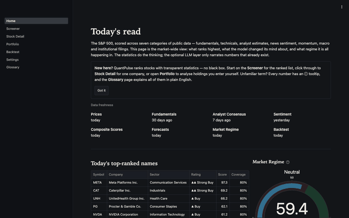
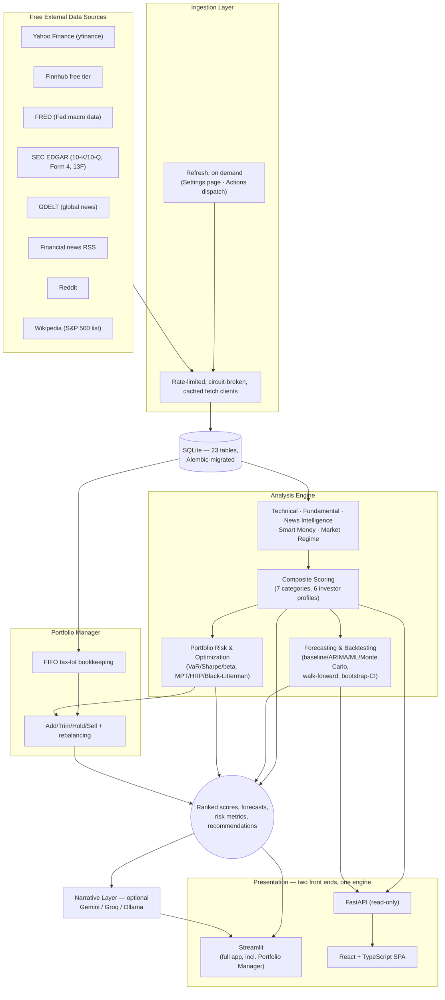
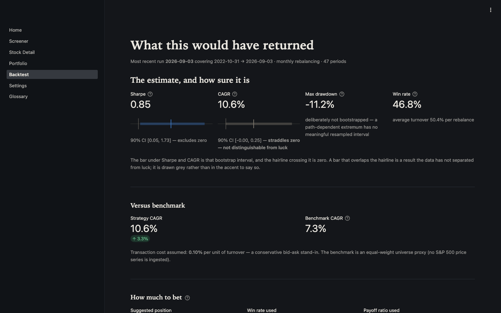

# QuantPulse

[](https://github.com/MarlenMM/quantpulse/actions/workflows/ci.yml)
[](https://marlenmm.github.io/quantpulse/)
[](tests/)
[](.python-version)
[](LICENSE)

A self-hosted, $0-cost stock research & portfolio-management engine. Statistics and ML do the ranking/forecasting; a free-tier LLM only narrates results that already exist.

**Live demo: <https://marlenmm.github.io/quantpulse/>** — the research front end, no sign-up and no keys. It is read-only (GitHub Pages serves files; the Portfolio Manager needs to write).

**Run the whole thing locally, including the Portfolio Manager:** `./run.sh`. One command, no API key, no account — see [HOW_TO_USE.md](HOW_TO_USE.md) for a plain-English guide to both, and to which numbers on screen are solid and which are thin.

> **Why a fresh clone is ~70 MB.** `quantpulse_demo.db` (63 MB) is committed on
> purpose: it is what makes `./run.sh`, the test suite and the public demo work
> immediately, with no hours-long seeding run and no API keys — a deliberate
> trade of repository size against a reader's first five minutes. Your own
> working database (`quantpulse.db`) is gitignored and never committed. The
> reasoning, and how to rebuild the demo database from scratch, are under
> [Data and secrets](#data-and-secrets).



*Screenshots use synthetic data run through the real scoring/forecasting/backtest pipeline — see [docs/screenshots/README.md](docs/screenshots/README.md) for how, and why never against real API data.*

See [PROJECT_PLAN.md](PROJECT_PLAN.md) for the full design doc (architecture, data sources, scoring methodology, roadmap) and [ARCHITECTURE.md](ARCHITECTURE.md) for a shorter, code-first tour of how it's actually laid out.

**Status:** Phases 0–12 of the roadmap are complete — data layer, technical/fundamental/analyst/news/smart-money signals, the market-regime index, composite scoring, forecasting + backtesting, portfolio risk/optimization/rebalancing tools, the optional LLM narration layer, all six Streamlit pages plus the React + FastAPI stretch front end, the full unit/integration/property-based test suite, CI/CD, and the polish pass — as is Section 21's standalone final methodology review. Nothing here makes trade or investment decisions.

The LLM layer is optional by design: with no API key set (or `LLM_ENABLED=false`), every number the app computes is still produced and displayed — you just don't get the plain-English paragraph next to it.

## By the numbers

| | |
|---|---|
| Automated tests | **1,500** (unit, integration, and property-based via Hypothesis) |
| Core engine code | **~16,700** lines (`src/quantpulse/`) — ingestion, analysis, storage, API |
| Free data sources integrated | **8** feed each refresh — Yahoo Finance, Finnhub, FRED, SEC EDGAR (filings + 13F), GDELT, Reddit, financial news RSS, Wikipedia — plus a 9th (a historical S&P 500 constituents dataset) used only for the one-time cold-start backfill |
| Database | **23 tables**, **12 Alembic migrations**, every one reversible (`alembic downgrade` round-trips clean) |
| Composite scoring | **7 categories** (fundamentals, technicals, analyst consensus, news sentiment, momentum, industry/macro, smart money) × **6 investor-profile presets** — four differ by category weights alone, and two (income, conservative) genuinely re-score a category, so each refresh stores their rankings separately |
| Chart pattern families detected | **4** — head-and-shoulders, double top/bottom, triangles/wedges/channels, cup-and-handle — detected across the whole universe on every refresh and shown per stock with a confidence score |
| Forecasting approaches | **4** — random-walk baseline, ARIMA/SARIMA, gradient-boosted ML, and a Monte Carlo fan chart. The first three are graded out-of-sample against the naive baseline; Monte Carlo deliberately is not, because it simulates the same random walk the baseline evaluates in closed form (grading it would be grading the baseline against itself) |
| Backtest confidence | Sharpe & CAGR reported with **moving-block bootstrap** confidence intervals, never a bare point estimate |
| Portfolio optimization methods | **3** — mean-variance (MPT), Hierarchical Risk Parity, and Black-Litterman driven by the app's own composite scores, each with a concrete buy/sell trade list |
| Front ends | **2** — a 7-page Streamlit app (full app, incl. Portfolio Manager and the LLM narration layer) and a 5-page React + TypeScript SPA over a 14-endpoint read-only FastAPI. The two share every number: both read the same `storage.persistence` functions, the React screener's client-side re-weighting was checked against Streamlit's across all 503 names, and the numbers a stock shows on both (beta, Sharpe, Sortino, forecast prices, Kelly size) are asserted equal by test. The SPA omits only the LLM narration and the Portfolio Manager, which need write access and an API key the read-only API deliberately does not have |
| Glossary terms | **71**, across 8 categories — one definition shared by every tooltip and both front ends |
| Required budget | **$0** — every data source, model, and hosting option used is free-tier or open-source |

## Architecture



**Data flow in one sentence:** free APIs feed a scheduled ingestion job → normalized data lands in SQLite → a stack of independent, testable analysis modules score every stock on several dimensions → the scores combine into one ranking, a forecast, and portfolio-level guidance → two front ends display it, optionally narrated in plain English by a free-tier LLM. See [ARCHITECTURE.md](ARCHITECTURE.md) for the module-by-module tour.

## Quickstart

```bash
# 1. Install uv (https://docs.astral.sh/uv/) if you don't have it
brew install uv

# 2. Install dependencies (creates .venv automatically, pinned to Python 3.12)
uv sync

# 3. Configure environment
cp .env.example .env
# edit .env with your own API keys (all free-tier; see .env.example for where to get each one)

# 4. Apply database migrations (alembic.ini lives at the repo root)
uv run alembic upgrade head

# 5. Run the test suite
uv run pytest

# 6. Launch the app (works against an empty database — it tells you how to populate it)
uv run streamlit run app/Home.py
```

## Two front ends, one engine

The analysis engine never imports from a UI (Section 14), which is what makes
two front ends possible without duplicating a line of analysis:

| | Streamlit (`app/`) | React + FastAPI (`frontend/` + `src/quantpulse/api/`) |
|---|---|---|
| Role | The full app, including the Portfolio Manager | Stretch goal (ADR 4.1) — showcases the UI-agnostic engine |
| Hosting | Streamlit Community Cloud, free and always-on | Render/Fly.io + Vercel free tiers |
| Portfolio management | Yes | No — the API is read-only by design (see below) |

```bash
# React + FastAPI (two terminals)
uv run uvicorn quantpulse.api.main:app --reload   # API on :8000, docs at /docs
cd frontend && npm install && npm run dev          # SPA on :5173, proxies /api
```

**The API is deliberately read-only.** Portfolio state is per-user and ADR 4.5
splits it between a browser session and a local SQLite file; neither maps onto
a stateless REST API without the authentication the single-user MVP explicitly
doesn't have (Section 18). Portfolio management therefore stays in Streamlit,
where its storage backends already live.

### Populating it with real data

```bash
uv run python scripts/seed_initial_data.py   # one-time historical backfill (slow)
uv run python scripts/refresh_data.py        # incremental refresh + scoring (also a button in the app)
```

The backfill takes a few hours for the full ~1,200-symbol universe and is
resumable — it infers progress from the database, so re-running it continues
rather than starting over. Expect roughly 300 MB.

**Refreshes are manual, on purpose.** Nothing runs on a timer: the data changes
when you ask it to, from **⚙️ Settings → Run a refresh** in the app (the usual
way — it runs in the background and tails its own log while you keep using the
app) or by running the script above. Two things follow from there being no
schedule, and the page offers a checkbox for each:

- **Run it after the US close.** Earlier and the day's closing prices and option
  chain simply have not been published yet.
- **The weekly branch no longer comes round by itself.** Fundamentals, analyst
  consensus, 13F, forecasts, the backtest, news and sentiment key off Monday, so
  tick *Include the weekly steps* to refresh them on any other day. That run
  takes hours rather than minutes.
- A refresh is a deliberate no-op on a weekend or holiday unless you tick *Run
  even though the market is closed today*.

#### Known limitation: survivorship coverage of delisted companies

The backtest is built to be survivorship-bias-free: `index_membership_history`
records point-in-time index membership, so a company that was in the S&P 500 in
2019 and later went bankrupt is *in* the 2019 rebalance and realises its loss
rather than vanishing from history.

That machinery only helps if those companies have **prices**. They largely
don't. On a real full backfill, price history was available for **98.8% of
current members but only 49% of delisted ones** — free sources simply do not
carry most long-dead tickers. `seed_initial_data.py` measures this and reports
status `partial_survivorship_gap` when coverage falls below 50%, rather than
letting it pass silently.

**What this means when reading a backtest result here:** the losers are
under-represented, so the track record is flattered by an unknown amount. The
membership data is honest; the price coverage behind it is partial. This is
stated rather than engineered around because no amount of code fixes a source
that doesn't have the data (Section 22: an honestly-labelled limitation beats a
silently inflated number).

A related data-quality note: adjusted-close history for long-delisted names is
frequently corrupt — one real example moved from $0.005 to $305.00 in a single
bar. `read_adj_close_panel` drops any symbol containing a greater-than-10x
bar-to-bar move, since a broken adjustment factor corrupts the whole series it
scales. On the real universe this removed 26 of 825 symbols, and that count did
not grow when the panel expanded by 330 names.

## Pages

| Page | What it shows |
|---|---|
| **Dashboard** | Market Regime Index gauge, top-ranked names, what changed since the last refresh, sector rotation, market-moving Tier-2/3 news |
| **Screener** | The ranked, filterable table, with sliders that re-weight the seven score categories *and re-rate against them* client-side, a relative/absolute rating-scheme switch, and a 2–4 ticker Compare mode |
| **Stock Detail** | Price chart with support/resistance and detected patterns, sub-score radar, forecast fan chart with each model's own hit-rate *and the number of windows behind it*, Monte Carlo paths, per-stock risk block, short interest read both ways, sector macro overlay, news feed, optional plain-English summaries of the sentiment move and the latest SEC filing, and a chat box grounded strictly in that stock's computed numbers |
| **Portfolio & Watchlist** | FIFO tax-lot positions, risk dashboard (vol/Sharpe/Sortino/beta/VaR/correlations + correlation clusters), a target allocation from any of the three optimizers with its concrete trade list, Add-Trim-Hold-Sell guidance, concentration + sector-gap warnings |
| **Backtest / Track Record** | Sharpe and CAGR with bootstrap confidence intervals, benchmark comparison, stated cost assumptions |
| **Settings / About** | Data freshness per dataset, pipeline health, configuration, methodology and limitations |

Section 20's own advice: *"the Backtest/Track Record page is your strongest
talking point in an interview — lead with it."*



## How QuantPulse compares

Positioned deliberately, not as a like-for-like competitor to a commercial
screener — see [Section 2 of the plan](PROJECT_PLAN.md#2-scope-what-this-is-and-isnt)
for the full, honest list of what's explicitly out of scope:

| | QuantPulse | Finviz / TradingView (free tiers) |
|---|---|---|
| Cost | $0, always | Free tier, paywall for the deeper screens/alerts |
| Ranking methodology | Fully transparent — read the actual scoring source | Proprietary/opaque |
| Backtesting | Built in: walk-forward, bootstrap-confidence-interval-aware | Not available on free tiers |
| Portfolio-level guidance | Add/Trim/Hold/Sell + concentration/sector-gap warnings | Watchlists only, no guidance |
| Data cadence | Batch, refreshed when you ask it to, by design (Section 2) — a research tool, not a ticker tape | Real-time |
| Coverage | US equities & ETFs, S&P 500 universe | Global, much broader |
| News/sentiment | 3-tier (company/industry/market), scored by a local FinBERT model | Headlines only, no built-in scoring |

The honest trade: QuantPulse gives up real-time breadth and global coverage
for full transparency, built-in backtesting rigor, and portfolio-specific
guidance a free screener doesn't offer.

## Live Demo & Deployment

There are two deployments, and they are deliberately different shapes.

### 1. GitHub Pages — the public link, fully automated

**<https://marlenmm.github.io/quantpulse/>**

The React SPA, served as static files, free on public repos, always on, nothing
to sign into. Pages cannot run Python, so `scripts/build_static_site.py`
pre-renders the read API instead: it runs the real FastAPI app through
Starlette's `TestClient` over the committed demo database and writes every
response the client can ask for (524 files, ~29 MB). **The published numbers are
the API's own output**, not a second implementation — the same discipline that
keeps the two front ends agreeing.

`.github/workflows/pages.yml` builds and publishes it on every push to `main`,
and the refresh workflow calls it directly once it has committed fresh data.
(It has to be an explicit call: the refresh's commit carries `[skip ci]`, which
suppresses every workflow a push would otherwise start.)

Before publishing, the workflow loads the finished bundle in a real browser and
reads real numbers off it. That check is load-bearing rather than ceremonial:
the generator and the client agree about filenames only by convention, they are
in different languages, and a one-character disagreement would 404 every request
while the type check, the build and the unit tests all stayed green.

**What Pages cannot host:** the Portfolio Manager. It needs per-visitor write
state, and the API is read-only by design (see `api/main.py`'s docstring). Run
`./run.sh` for that, or deploy the Streamlit app below.

### 2. Streamlit Community Cloud — the full app, one manual step

The seven-page Streamlit app, including the Portfolio Manager and the LLM
narration layer. Connecting a repo needs an interactive GitHub sign-in, so this
is the one step that cannot be scripted. The repo is already prepared for it:

1. Go to **<https://share.streamlit.io>** and sign in with GitHub.
2. **Create app** → **Deploy a public app from GitHub**.
3. Fill in: Repository `MarlenMM/quantpulse`, Branch `main`, Main file path
   `app/Home.py`. Under **Advanced settings**, set Python version **3.12**.
4. In the same **Advanced settings** panel, paste this into **Secrets**:
   ```toml
   DATABASE_URL = "sqlite:///./quantpulse_demo.db"
   PORTFOLIO_BACKEND = "session"
   ```
5. **Deploy**. First build takes a few minutes.

`requirements.txt` is what that host installs, and it deliberately omits torch,
transformers and spaCy — the refresh job's models, roughly 2.5 GB of wheels,
which no page imports and the free tier cannot fit. It is generated from
`uv.lock` by `scripts/sync_requirements.py`, and every page render in the test
suite asserts none of the three ends up in `sys.modules`.

`PORTFOLIO_BACKEND=session` is the part that matters (ADR 4.5): it keeps every
visitor's holdings in their own browser session rather than the shared committed
file. An LLM key (Section 4.3) is optional — the app runs fine without one.

Streamlit Community Cloud auto-redeploys on every push to `main`, so each
night's data commit refreshes the live app with no separate step.

### Data and secrets

`.github/workflows/refresh_data.yml` updates the repo-committed demo database
(`quantpulse_demo.db` — distinct from your own local `quantpulse.db`, see
`.gitignore`), so neither deployment needs API keys of its own (ADR 4.4). It is
**dispatched by hand** (Actions → Data Refresh → Run workflow), not on a
schedule — so both public deployments are only as fresh as the last time
somebody ran it. The in-app refresh button stays off in hosted `session` mode
(`MANUAL_REFRESH_ENABLED`): a shared URL is no place to let a visitor start an
hours-long job on rate-limited quota, and that host omits the model stack the
refresh needs anyway.

That database is already seeded and committed — a fresh clone has real data
immediately, which is why `./run.sh` needs no setup. To rebuild it from scratch
(after a long gap, or to change the history depth):

```bash
DATABASE_URL=sqlite:///./quantpulse_demo.db uv run alembic upgrade head
DATABASE_URL=sqlite:///./quantpulse_demo.db uv run python scripts/seed_initial_data.py
git add quantpulse_demo.db && git commit -m "Reseed the live-demo database" && git push
```

Dispatching the workflow then keeps it current, committing an updated
`quantpulse_demo.db` back to `main` (the workflow file's own comments explain
why that is safe given ADR 4.5's session-vs-sqlite split) and republishing the
Pages site against it.

Fresher data needs **repo secrets** (Settings → Secrets and variables →
Actions). **Without them the job still runs, but some datasets stay
permanently empty**, and the app shows them as "never run" rather than
pretending otherwise. Worth knowing which cost what:

   | Secret | What stays empty without it |
   |---|---|
   | `FINNHUB_API_KEY` | Short interest (Section 24's two readings) |
   | `FRED_API_KEY` | Fed funds, CPI, unemployment, GDP, and the 10Y/2Y series — so the yield-curve spread drops out of the Market Regime Index |
   | `SEC_EDGAR_USER_AGENT` | Insider (Form 4) and 13F institutional ownership. This one is **not an API key** — SEC only asks for a contact string like `"Your Name your@email.com"`, so it costs nothing but a repo secret |

   Everything else — prices, options, news, fundamentals, analyst consensus,
   the index constituent list — comes from sources that need no credential at
   all, which is why the composite score still computes without any of the
   above (at a lower `data_confidence`, which every page displays).

   As of 2026-08-08 only `SEC_EDGAR_USER_AGENT` is set, so short interest and
   the FRED macro series are empty in the published demo — which every page
   reports as "never run" rather than scoring as zero.

## Development

- Lint/format: `uv run ruff check .` / `uv run ruff format .`
- Type-check: `uv run mypy src`
- Enable git hooks (runs ruff + mypy on every commit): `uv run pre-commit install`
- Want to contribute? See [CONTRIBUTING.md](CONTRIBUTING.md).

## Project layout

[ARCHITECTURE.md](ARCHITECTURE.md) has the module-by-module tour; [Section 14
of the plan](PROJECT_PLAN.md#14-project-folder-structure) has the original
intended structure. The `analysis/` package never imports from `app/`, so the
analysis engine stays UI-agnostic.

## Roadmap

Full detail in [Section 15 of the plan](PROJECT_PLAN.md#15-development-roadmap--milestones).
Phases 0–12 are complete, as is Section 21's final look-ahead-bias/
normalization review across the scoring → forecasting → backtest chain, and the
public demo is live on GitHub Pages. The one thing left is optional: connecting
the repo to Streamlit Community Cloud for a hosted copy of the *full* app,
which needs an interactive sign-in nobody can script (steps above). `./run.sh`
gives you the same thing locally in the meantime.

## Disclaimer

**Educational/research tool. Not financial advice. Not a registered investment advisor. Past backtested performance does not guarantee future results.**
