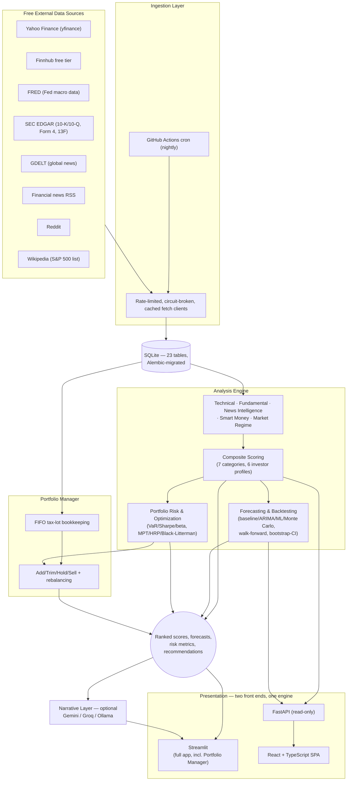

# QuantPulse

A self-hosted, $0-cost stock research & portfolio-management engine. Statistics and ML do the ranking/forecasting; a free-tier LLM only narrates results that already exist.

**Live demo:** not yet deployed — see [Live Demo & Deployment](#live-demo--deployment) below for the two steps to stand one up on Streamlit Community Cloud.


*Screenshots use synthetic data run through the real scoring/forecasting/backtest pipeline — see [docs/screenshots/README.md](docs/screenshots/README.md) for how, and why never against real API data.*

See [PROJECT_PLAN.md](PROJECT_PLAN.md) for the full design doc (architecture, data sources, scoring methodology, roadmap) and [ARCHITECTURE.md](ARCHITECTURE.md) for a shorter, code-first tour of how it's actually laid out.

**Status:** Phases 0–12 of the roadmap are complete — data layer, technical/fundamental/analyst/news/smart-money signals, the market-regime index, composite scoring, forecasting + backtesting, portfolio risk/optimization/rebalancing tools, the optional LLM narration layer, all six Streamlit pages plus the React + FastAPI stretch front end, the full unit/integration/property-based test suite, CI/CD, and the polish pass — as is Section 21's standalone final methodology review. Nothing here makes trade or investment decisions.

The LLM layer is optional by design: with no API key set (or `LLM_ENABLED=false`), every number the app computes is still produced and displayed — you just don't get the plain-English paragraph next to it.

## By the numbers

| | |
|---|---|
| Automated tests | **1,297** (unit, integration, and property-based via Hypothesis), all passing |
| Core engine code | **~16,000** lines (`src/quantpulse/`) — ingestion, analysis, storage, API |
| Free data sources integrated | **8** feed the nightly refresh — Yahoo Finance, Finnhub, FRED, SEC EDGAR (filings + 13F), GDELT, Reddit, financial news RSS, Wikipedia — plus a 9th (a historical S&P 500 constituents dataset) used only for the one-time cold-start backfill |
| Database | **23 tables**, **12 Alembic migrations**, every one reversible (`alembic downgrade` round-trips clean) |
| Composite scoring | **7 categories** (fundamentals, technicals, analyst consensus, news sentiment, momentum, industry/macro, smart money) × **6 investor-profile presets** — four differ by category weights alone, and two (income, conservative) genuinely re-score a category, so the nightly stores their rankings separately |
| Chart pattern families detected | **4** — head-and-shoulders, double top/bottom, triangles/wedges/channels, cup-and-handle — detected nightly across the universe and shown per stock with a confidence score |
| Forecasting approaches | **4** — random-walk baseline, ARIMA/SARIMA, gradient-boosted ML, and a Monte Carlo fan chart. The first three are graded out-of-sample against the naive baseline; Monte Carlo deliberately is not, because it simulates the same random walk the baseline evaluates in closed form (grading it would be grading the baseline against itself) |
| Backtest confidence | Sharpe & CAGR reported with **moving-block bootstrap** confidence intervals, never a bare point estimate |
| Portfolio optimization methods | **3** — mean-variance (MPT), Hierarchical Risk Parity, and Black-Litterman driven by the app's own composite scores, each with a concrete buy/sell trade list |
| Front ends | **2** — a 6-page Streamlit app (full app, incl. Portfolio Manager) and a 5-page React + TypeScript SPA over an 11-endpoint read-only FastAPI |
| Glossary terms | **71**, across 8 categories — one definition shared by every tooltip and both front ends |
| Required budget | **$0** — every data source, model, and hosting option used is free-tier or open-source |

## Architecture



**Data flow in one sentence:** free APIs feed a scheduled ingestion job → normalized data lands in SQLite → a stack of independent, testable analysis modules score every stock on several dimensions → the scores combine into one ranking, a forecast, and portfolio-level guidance → two front ends display it, optionally narrated in plain English by a free-tier LLM. See [ARCHITECTURE.md](ARCHITECTURE.md) for the module-by-module tour.

## Quickstart

```bash
# 1. Install uv (https://docs.astral.sh/uv/) if you don't have it
brew install uv

# 2. Install dependencies (creates .venv automatically, pinned to Python 3.12)
uv sync

# 3. Configure environment
cp .env.example .env
# edit .env with your own API keys (all free-tier; see .env.example for where to get each one)

# 4. Apply database migrations (alembic.ini lives at the repo root)
uv run alembic upgrade head

# 5. Run the test suite
uv run pytest

# 6. Launch the app (works against an empty database — it tells you how to populate it)
uv run streamlit run app/Home.py
```

## Two front ends, one engine

The analysis engine never imports from a UI (Section 14), which is what makes
two front ends possible without duplicating a line of analysis:

| | Streamlit (`app/`) | React + FastAPI (`frontend/` + `src/quantpulse/api/`) |
|---|---|---|
| Role | The full app, including the Portfolio Manager | Stretch goal (ADR 4.1) — showcases the UI-agnostic engine |
| Hosting | Streamlit Community Cloud, free and always-on | Render/Fly.io + Vercel free tiers |
| Portfolio management | Yes | No — the API is read-only by design (see below) |

```bash
# React + FastAPI (two terminals)
uv run uvicorn quantpulse.api.main:app --reload   # API on :8000, docs at /docs
cd frontend && npm install && npm run dev          # SPA on :5173, proxies /api
```

**The API is deliberately read-only.** Portfolio state is per-user and ADR 4.5
splits it between a browser session and a local SQLite file; neither maps onto
a stateless REST API without the authentication the single-user MVP explicitly
doesn't have (Section 18). Portfolio management therefore stays in Streamlit,
where its storage backends already live.

### Populating it with real data

```bash
uv run python scripts/seed_initial_data.py   # one-time historical backfill (slow)
uv run python scripts/refresh_data.py        # nightly incremental refresh + scoring
```

The backfill takes a few hours for the full ~1,200-symbol universe and is
resumable — it infers progress from the database, so re-running it continues
rather than starting over. Expect roughly 300 MB.

#### Known limitation: survivorship coverage of delisted companies

The backtest is built to be survivorship-bias-free: `index_membership_history`
records point-in-time index membership, so a company that was in the S&P 500 in
2019 and later went bankrupt is *in* the 2019 rebalance and realises its loss
rather than vanishing from history.

That machinery only helps if those companies have **prices**. They largely
don't. On a real full backfill, price history was available for **98.8% of
current members but only 49% of delisted ones** — free sources simply do not
carry most long-dead tickers. `seed_initial_data.py` measures this and reports
status `partial_survivorship_gap` when coverage falls below 50%, rather than
letting it pass silently.

**What this means when reading a backtest result here:** the losers are
under-represented, so the track record is flattered by an unknown amount. The
membership data is honest; the price coverage behind it is partial. This is
stated rather than engineered around because no amount of code fixes a source
that doesn't have the data (Section 22: an honestly-labelled limitation beats a
silently inflated number).

A related data-quality note: adjusted-close history for long-delisted names is
frequently corrupt — one real example moved from $0.005 to $305.00 in a single
bar. `read_adj_close_panel` drops any symbol containing a greater-than-10x
bar-to-bar move, since a broken adjustment factor corrupts the whole series it
scales. On the real universe this removed 26 of 825 symbols, and that count did
not grow when the panel expanded by 330 names.

## Pages

| Page | What it shows |
|---|---|
| **Dashboard** | Market Regime Index gauge, top-ranked names, what changed since the last refresh, sector rotation, market-moving Tier-2/3 news |
| **Screener** | The ranked, filterable table, with sliders that re-weight the seven score categories *and re-rate against them* client-side, a relative/absolute rating-scheme switch, and a 2–4 ticker Compare mode |
| **Stock Detail** | Price chart with support/resistance and detected patterns, sub-score radar, forecast fan chart with each model's own hit-rate *and the number of windows behind it*, Monte Carlo paths, per-stock risk block, short interest read both ways, sector macro overlay, news feed, optional plain-English summaries of the sentiment move and the latest SEC filing, and a chat box grounded strictly in that stock's computed numbers |
| **Portfolio & Watchlist** | FIFO tax-lot positions, risk dashboard (vol/Sharpe/Sortino/beta/VaR/correlations + correlation clusters), a target allocation from any of the three optimizers with its concrete trade list, Add-Trim-Hold-Sell guidance, concentration + sector-gap warnings |
| **Backtest / Track Record** | Sharpe and CAGR with bootstrap confidence intervals, benchmark comparison, stated cost assumptions |
| **Settings / About** | Data freshness per dataset, pipeline health, configuration, methodology and limitations |

Section 20's own advice: *"the Backtest/Track Record page is your strongest
talking point in an interview — lead with it."*


## How QuantPulse compares

Positioned deliberately, not as a like-for-like competitor to a commercial
screener — see [Section 2 of the plan](PROJECT_PLAN.md#2-scope-what-this-is-and-isnt)
for the full, honest list of what's explicitly out of scope:

| | QuantPulse | Finviz / TradingView (free tiers) |
|---|---|---|
| Cost | $0, always | Free tier, paywall for the deeper screens/alerts |
| Ranking methodology | Fully transparent — read the actual scoring source | Proprietary/opaque |
| Backtesting | Built in: walk-forward, bootstrap-confidence-interval-aware | Not available on free tiers |
| Portfolio-level guidance | Add/Trim/Hold/Sell + concentration/sector-gap warnings | Watchlists only, no guidance |
| Data cadence | Nightly batch, by design (Section 2) — a research tool, not a ticker tape | Real-time |
| Coverage | US equities & ETFs, S&P 500 universe | Global, much broader |
| News/sentiment | 3-tier (company/industry/market), scored by a local FinBERT model | Headlines only, no built-in scoring |

The honest trade: QuantPulse gives up real-time breadth and global coverage
for full transparency, built-in backtesting rigor, and portfolio-specific
guidance a free screener doesn't offer.

## Live Demo & Deployment

`.github/workflows/refresh_data.yml` keeps a small, repo-committed demo
database (`quantpulse_demo.db` — distinct from your own local
`quantpulse.db`, see `.gitignore`) up to date every weeknight, so Streamlit
Community Cloud can serve a public demo without the live app needing any API
keys of its own (ADR 4.4). Two one-time steps, both manual — neither can be
scripted from outside your own accounts:

1. **Seed the demo database once**, locally, with your own free-tier keys:
   ```bash
   DATABASE_URL=sqlite:///./quantpulse_demo.db uv run alembic upgrade head
   DATABASE_URL=sqlite:///./quantpulse_demo.db uv run python scripts/seed_initial_data.py
   git add quantpulse_demo.db && git commit -m "Seed the live-demo database" && git push
   ```
   After this, the nightly workflow takes over — it commits an updated
   `quantpulse_demo.db` back to `main` every weeknight (see the workflow
   file's own comments for why that's safe now that ADR 4.5's session-vs-
   sqlite split exists). Also add `FINNHUB_API_KEY` / `FRED_API_KEY` /
   `SEC_EDGAR_USER_AGENT` as **repo secrets** (Settings → Secrets and
   variables → Actions) so the nightly job itself can fetch fresh data.

2. **Connect the repo at [share.streamlit.io](https://share.streamlit.io)**:
   point it at this repo, branch `main`, main file `app/Home.py`, then set
   these under the *app's* own Settings → Secrets (a `.streamlit/secrets.toml`-
   format screen, separate from the GitHub repo secrets above):
   ```toml
   DATABASE_URL = "sqlite:///./quantpulse_demo.db"
   PORTFOLIO_BACKEND = "session"
   ```
   `PORTFOLIO_BACKEND=session` is the part that actually matters (ADR 4.5):
   it keeps every visitor's portfolio entries in their own browser session
   instead of the shared file, so the committed demo database only ever
   holds the same public screener/market data every visitor already sees.
   An LLM key (Section 4.3) is optional — the app runs fine without one.

Streamlit Community Cloud auto-redeploys on every push to `main`, so each
night's data commit above refreshes the live app automatically — no
separate redeploy step to remember. Once connected, replace the "not yet
deployed" line near the top of this file with the actual `share.streamlit.io`
URL.

## Development

- Lint/format: `uv run ruff check .` / `uv run ruff format .`
- Type-check: `uv run mypy src`
- Enable git hooks (runs ruff + mypy on every commit): `uv run pre-commit install`
- Want to contribute? See [CONTRIBUTING.md](CONTRIBUTING.md).

## Project layout

[ARCHITECTURE.md](ARCHITECTURE.md) has the module-by-module tour; [Section 14
of the plan](PROJECT_PLAN.md#14-project-folder-structure) has the original
intended structure. The `analysis/` package never imports from `app/`, so the
analysis engine stays UI-agnostic.

## Roadmap

Full detail in [Section 15 of the plan](PROJECT_PLAN.md#15-development-roadmap--milestones).
Phases 0–12 are complete, as is Section 21's final look-ahead-bias/
normalization review across the scoring → forecasting → backtest chain. What's
left is the two manual "Live Demo & Deployment" steps above, which need your
own accounts and API keys and can't be scripted from the repo.

## Disclaimer

**Educational/research tool. Not financial advice. Not a registered investment advisor. Past backtested performance does not guarantee future results.**
