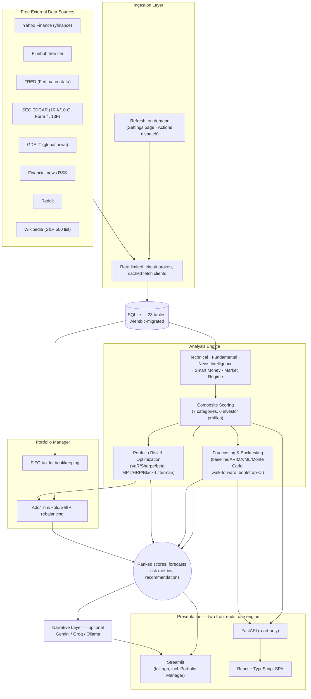

# QuantPulse

[](https://github.com/MarlenMM/quantpulse/actions/workflows/ci.yml)
[](https://marlenmm.github.io/quantpulse/)
[](tests/)
[](.python-version)
[](LICENSE)

A self-hosted, $0-cost stock research & portfolio-management engine. Statistics and ML do the ranking/forecasting; a free-tier LLM only narrates results that already exist.

**Live demo: <https://marlenmm.github.io/quantpulse/>** — the research front end, no sign-up and no keys, and it holds its shape on a phone. Its Portfolio page keeps your holdings in your own browser — nothing is sent anywhere; the full Portfolio Manager, with the optimisers, rebalancing and history, is the Streamlit app.

**Run the whole thing locally, including the Portfolio Manager:** `./run.sh`. One command, no API key, no account — see [HOW_TO_USE.md](HOW_TO_USE.md) for a plain-English guide to both, and to which numbers on screen are solid and which are thin.

> **The demo database is a release asset, not a committed file.** It is ~66 MB,
> and forty committed revisions of it had reached **309 MB of a 317 MB
> repository** — 97.5%, against 8 MB for every source file, test and document
> put together — growing about 7.7 MB per refresh, five refreshes a week. It now
> lives on the rolling [`demo-data`](https://github.com/MarlenMM/quantpulse/releases/tag/demo-data)
> release tag, and its old revisions were removed from history on 2026-09-13 —
> a full clone went from ~317 MB to 13 MB. `./run.sh` downloads it once on first run, and so do CI, the
> Pages build and the Streamlit app; nothing needs an API key. A clone is small
> again, and the file is fetched once rather than every version of it ever made
> arriving with the clone.


*Screenshots use synthetic data run through the real scoring/forecasting/backtest pipeline — see [docs/screenshots/README.md](docs/screenshots/README.md) for how, and why never against real API data.*

See [PROJECT_PLAN.md](PROJECT_PLAN.md) for the full design doc (architecture, data sources, scoring methodology, roadmap) and [ARCHITECTURE.md](ARCHITECTURE.md) for a shorter, code-first tour of how it's actually laid out.

**Status:** Phases 0–12 of the roadmap are complete — data layer, technical/fundamental/analyst/news/smart-money signals, the market-regime index, composite scoring, forecasting + backtesting, portfolio risk/optimization/rebalancing tools, the optional LLM narration layer, all six Streamlit pages plus the React + FastAPI stretch front end, the full unit/integration/property-based test suite, CI/CD, and the polish pass — as is Section 21's standalone final methodology review. Nothing here makes trade or investment decisions.

The LLM layer is optional by design: with no API key set (or `LLM_ENABLED=false`), every number the app computes is still produced and displayed — you just don't get the plain-English paragraph next to it.

## By the numbers

| | |
|---|---|
| Automated tests | **1,554** (unit, integration, and property-based via Hypothesis) |
| Core engine code | **~16,700** lines (`src/quantpulse/`) — ingestion, analysis, storage, API |
| Free data sources integrated | **8** feed each refresh — Yahoo Finance, Finnhub, FRED, SEC EDGAR (filings + 13F), GDELT, Reddit, financial news RSS, Wikipedia — plus a 9th (a historical S&P 500 constituents dataset) used only for the one-time cold-start backfill |
| Database | **23 tables**, **13 Alembic migrations**, every one reversible (`alembic downgrade` round-trips clean) |
| Composite scoring | **7 categories** (fundamentals, technicals, analyst consensus, news sentiment, momentum, industry/macro, smart money) × **6 investor-profile presets** — four differ by category weights alone, and two (income, conservative) genuinely re-score a category, so each refresh stores their rankings separately |
| Chart pattern families detected | **4** — head-and-shoulders, double top/bottom, triangles/wedges/channels, cup-and-handle — detected across the whole universe on every refresh and shown per stock with a confidence score |
| Forecasting approaches | **4** — random-walk baseline, ARIMA/SARIMA, gradient-boosted ML, and a Monte Carlo fan chart. The first three are graded out-of-sample against the naive baseline; Monte Carlo deliberately is not, because it simulates the same random walk the baseline evaluates in closed form (grading it would be grading the baseline against itself) |
| Backtest confidence | Sharpe & CAGR reported with **moving-block bootstrap** confidence intervals, never a bare point estimate |
| Portfolio optimization methods | **3** — mean-variance (MPT), Hierarchical Risk Parity, and Black-Litterman driven by the app's own composite scores, each with a concrete buy/sell trade list |
| Front ends | **2** — a 7-page Streamlit app (full app, incl. Portfolio Manager and the LLM narration layer) and a 6-page React + TypeScript SPA over a 14-endpoint read-only FastAPI. The two share every number: both read the same `storage.persistence` functions, the React screener's client-side re-weighting was checked against Streamlit's across all 503 names, and the numbers a stock shows on both (beta, Sharpe, Sortino, forecast prices, Kelly size) are asserted equal by test. The SPA omits the LLM narration and the Portfolio Manager's optimisers, rebalancing and history; its Portfolio page (FIFO lots, P/L, per-holding suggestions, concentration, risk) runs in the browser and is pinned to the engine's own results by a golden-file test in both languages |
| Glossary terms | **71**, across 8 categories — one definition shared by every tooltip and both front ends |
| Required budget | **$0** — every data source, model, and hosting option used is free-tier or open-source |

## Architecture



**Data flow in one sentence:** free APIs feed a scheduled ingestion job → normalized data lands in SQLite → a stack of independent, testable analysis modules score every stock on several dimensions → the scores combine into one ranking, a forecast, and portfolio-level guidance → two front ends display it, optionally narrated in plain English by a free-tier LLM. See [ARCHITECTURE.md](ARCHITECTURE.md) for the module-by-module tour.

## Quickstart

```bash
# 1. Install uv (https://docs.astral.sh/uv/) if you don't have it
brew install uv

# 2. Install dependencies (creates .venv automatically, pinned to Python 3.12)
uv sync

# 3. Configure environment
cp .env.example .env
# edit .env with your own API keys (all free-tier; see .env.example for where to get each one)

# 4. Apply database migrations (alembic.ini lives at the repo root)
uv run alembic upgrade head

# 5. Run the test suite
uv run pytest

# 6. Launch the app (works against an empty database — it tells you how to populate it)
uv run streamlit run app/Home.py
```

## Two front ends, one engine

The analysis engine never imports from a UI (Section 14), which is what makes
two front ends possible without duplicating a line of analysis:

| | Streamlit (`app/`) | React + FastAPI (`frontend/` + `src/quantpulse/api/`) |
|---|---|---|
| Role | The full app, including the Portfolio Manager | Stretch goal (ADR 4.1) — showcases the UI-agnostic engine |
| Hosting | Streamlit Community Cloud, free and always-on | Render/Fly.io + Vercel free tiers |
| Portfolio management | Yes | A browser-local subset — the API stays read-only (see below) |

```bash
# React + FastAPI (two terminals)
uv run uvicorn quantpulse.api.main:app --reload   # API on :8000, docs at /docs
cd frontend && npm install && npm run dev          # SPA on :5173, proxies /api
```

**The API is deliberately read-only.** Portfolio state is per-user and ADR 4.5
splits it between a browser session and a local SQLite file; neither maps onto
a stateless REST API without the authentication the single-user MVP explicitly
doesn't have (Section 18). The full Portfolio Manager therefore stays in
Streamlit, where its storage backends already live. The SPA's Portfolio page
writes nothing to any server: the transaction log lives in the browser's
`localStorage`, and a test asserts the client only ever issues plain GETs.

### Populating it with real data

```bash
uv run python scripts/seed_initial_data.py   # one-time historical backfill (slow)
uv run python scripts/refresh_data.py        # incremental refresh + scoring (also a button in the app)
```

The backfill takes a few hours for the full ~1,200-symbol universe and is
resumable — it infers progress from the database, so re-running it continues
rather than starting over. Expect roughly 300 MB.

**Your own database refreshes when you ask it to** — from **⚙️ Settings → Run a
refresh** in the app (the usual way: it runs in the background and tails its own
log while you keep using the app) or by running the script above. The *public
demo* is different and runs on a timer; see [Data and secrets](#data-and-secrets).

Three things are worth knowing before you start one by hand, and the page offers
a checkbox for the last two:

- **Run it after the US close.** Earlier and the day's closing prices and option
  chain simply have not been published yet.
- **The weekly branch keys off Monday.** Fundamentals, analyst consensus, 13F,
  forecasts, the backtest, news and sentiment only run then, so tick *Include the
  weekly steps* to refresh them on any other day. That run takes hours rather
  than minutes.
- A refresh is a deliberate no-op on a weekend or holiday unless you tick *Run
  even though the market is closed today*.

#### Known limitation: survivorship coverage of delisted companies

The backtest is built to be survivorship-bias-free: `index_membership_history`
records point-in-time index membership, so a company that was in the S&P 500 in
2019 and later went bankrupt is *in* the 2019 rebalance and realises its loss
rather than vanishing from history.

That machinery only helps if those companies have **prices**. They largely
don't. On a real full backfill, price history was available for **98.8% of
current members but only 49% of delisted ones** — free sources simply do not
carry most long-dead tickers. `seed_initial_data.py` measures this and reports
status `partial_survivorship_gap` when coverage falls below 50%, rather than
letting it pass silently.

**What this means when reading a backtest result here:** the losers are
under-represented, so the track record is flattered by an unknown amount. The
membership data is honest; the price coverage behind it is partial. This is
stated rather than engineered around because no amount of code fixes a source
that doesn't have the data (Section 22: an honestly-labelled limitation beats a
silently inflated number).

A related data-quality note: adjusted-close history for long-delisted names is
frequently corrupt — one real example moved from $0.005 to $305.00 in a single
bar. `read_adj_close_panel` drops any symbol containing a greater-than-10x
bar-to-bar move, since a broken adjustment factor corrupts the whole series it
scales. On the real universe this removed 26 of 825 symbols, and that count did
not grow when the panel expanded by 330 names.

## Pages

| Page | What it shows |
|---|---|
| **Dashboard** | Market Regime Index gauge, top-ranked names, what changed since the last refresh, sector rotation, market-moving Tier-2/3 news |
| **Screener** | The ranked, filterable table, with sliders that re-weight the seven score categories *and re-rate against them* client-side, a relative/absolute rating-scheme switch, and a 2–4 ticker Compare mode |
| **Stock Detail** | Price chart with support/resistance and detected patterns, sub-score radar, forecast fan chart with each model's own hit-rate *and the number of windows behind it* (horizons with no measured accuracy — in practice every 63- and 252-day row — sit behind their own disclosure rather than beside the graded ones), Monte Carlo paths, per-stock risk block, short interest read both ways, sector macro overlay, news feed, optional plain-English summaries of the sentiment move and the latest SEC filing, and a chat box grounded strictly in that stock's computed numbers |
| **Portfolio & Watchlist** | FIFO tax-lot positions, risk dashboard (vol/Sharpe/Sortino/beta/VaR/correlations + correlation clusters), a target allocation from any of the three optimizers with its concrete trade list, Add-Trim-Hold-Sell guidance, concentration + sector-gap warnings |
| **Backtest / Track Record** | Sharpe and CAGR with bootstrap confidence intervals, benchmark comparison, stated cost assumptions — and the ranking signal named, with what it is *not* spelled out |
| **Settings / About** | Data freshness per dataset, pipeline health, configuration, methodology and limitations |

Section 20's own advice: *"the Backtest/Track Record page is your strongest
talking point in an interview — lead with it."*


## How QuantPulse compares

Positioned deliberately, not as a like-for-like competitor to a commercial
screener — see [Section 2 of the plan](PROJECT_PLAN.md#2-scope-what-this-is-and-isnt)
for the full, honest list of what's explicitly out of scope:

| | QuantPulse | Finviz / TradingView (free tiers) |
|---|---|---|
| Cost | $0, always | Free tier, paywall for the deeper screens/alerts |
| Ranking methodology | Fully transparent — read the actual scoring source | Proprietary/opaque |
| Backtesting | Built in: walk-forward, bootstrap-confidence-interval-aware | Not available on free tiers |
| Portfolio-level guidance | Add/Trim/Hold/Sell + concentration/sector-gap warnings | Watchlists only, no guidance |
| Data cadence | Batch, refreshed when you ask it to, by design (Section 2) — a research tool, not a ticker tape | Real-time |
| Coverage | US equities & ETFs, S&P 500 universe | Global, much broader |
| News/sentiment | 3-tier (company/industry/market), scored by a local FinBERT model | Headlines only, no built-in scoring |

The honest trade: QuantPulse gives up real-time breadth and global coverage
for full transparency, built-in backtesting rigor, and portfolio-specific
guidance a free screener doesn't offer.

## Live Demo & Deployment

There are two deployments, and they are deliberately different shapes.

### 1. GitHub Pages — the public link, fully automated

**<https://marlenmm.github.io/quantpulse/>**

The React SPA, served as static files, free on public repos, always on, nothing
to sign into. Pages cannot run Python, so `scripts/build_static_site.py`
pre-renders the read API instead: it runs the real FastAPI app through
Starlette's `TestClient` over the committed demo database and writes every
response the client can ask for (524 files, ~29 MB). **The published numbers are
the API's own output**, not a second implementation — the same discipline that
keeps the two front ends agreeing.

Every route is a real file, not a fallback: the build writes an `index.html`
per page and per stock, so `…/stocks/NVDA` answers **200** with its own
`<title>` rather than the 404-with-the-app-in-the-body that a single
`404.html` gives you. `404.html` is still there, for paths that genuinely are
not found.

`.github/workflows/pages.yml` builds and publishes it on every push to `main`,
and the refresh workflow calls it directly once it has committed fresh data.
(It has to be an explicit call: the refresh's commit carries `[skip ci]`, which
suppresses every workflow a push would otherwise start.)

Before publishing, the workflow loads the finished bundle in a real browser and
reads real numbers off it. That check is load-bearing rather than ceremonial:
the generator and the client agree about filenames only by convention, they are
in different languages, and a one-character disagreement would 404 every request
while the type check, the build and the unit tests all stayed green.

**What Pages cannot host:** the full Portfolio Manager — the optimisers, the
rebalancing trade list and the history panel need the engine's solvers or data
the demo does not publish. The demo's Portfolio page is the browser-local part
of it; for the rest run `./run.sh`, or deploy the Streamlit app below. A CSV
exported from the demo imports into it unchanged.

### 2. Streamlit Community Cloud — the full app, one manual step

The seven-page Streamlit app, including the Portfolio Manager and the LLM
narration layer. Connecting a repo needs an interactive GitHub sign-in, so this
is the one step that cannot be scripted. The repo is already prepared for it:

1. Go to **<https://share.streamlit.io>** and sign in with GitHub.
2. **Create app** → **Deploy a public app from GitHub**.
3. Fill in: Repository `MarlenMM/quantpulse`, Branch `main`, Main file path
   `app/Home.py`. Under **Advanced settings**, set Python version **3.12**.
4. In the same **Advanced settings** panel, paste this into **Secrets**:
   ```toml
   DATABASE_URL = "sqlite:///./quantpulse_demo.db"
   PORTFOLIO_BACKEND = "session"
   ```
5. **Deploy**. First build takes a few minutes.
6. Open the app. The first page view on a fresh (or woken) container downloads
   the demo database, about 83 MB, behind a spinner; later views are instant.
   Any page can be the first one — a shared link straight to the Screener works.

`app/requirements.txt` is what that host installs — a copy of the root
`requirements.txt` beside the entrypoint, because the host takes a dependency
file there ahead of the root, where it would otherwise pick `uv.lock` and install
everything (the first deploy did, 2026-09-25). It deliberately omits torch,
transformers and spaCy — the refresh job's models, roughly 2.5 GB of wheels,
which no page imports and the free tier cannot fit. It is generated from
`uv.lock` by `scripts/sync_requirements.py`, and every page render in the test
suite asserts none of the three ends up in `sys.modules`.

`PORTFOLIO_BACKEND=session` is the part that matters (ADR 4.5): it keeps every
visitor's holdings in their own browser session rather than the shared committed
file. An LLM key (Section 4.3) is optional — the app runs fine without one.

Streamlit Community Cloud auto-redeploys on every push to `main`. The data
itself no longer arrives that way — the database is a release asset, and
`app/Home.py` downloads it on first run through `quantpulse.demo_data`, which is
in the package precisely because that host puts only `app/` on `sys.path` and
could not import anything under `scripts/`. A restarted container picks up the
current data without a redeploy.

### Data and secrets

`.github/workflows/refresh_data.yml` rebuilds the demo database
(`quantpulse_demo.db` — distinct from your own local `quantpulse.db`, see
`.gitignore`) and publishes it to the `demo-data` release, so neither deployment
needs API keys of its own (ADR 4.4).

**There are two database assets, and the split is deliberate.** `demo-data` is
rolling — replaced every refresh, read by the demo, the Pages build and
`./run.sh`, because those want the current data. [`ci-fixture`](https://github.com/MarlenMM/quantpulse/releases/tag/ci-fixture)
is pinned, verified on download against `demo_data.CI_FIXTURE_SHA256`, and read
only by the CI test job. CI used to read the rolling one, so a refresh that
published a gutted database on 2026-09-15 turned three unrelated frontend pull
requests red on a Streamlit test about effective weights — a test job whose
inputs change underneath it is not testing the diff. Rolling the fixture forward
is a deliberate commit: upload a newer database to that release and put its
digest in the same change. The current data is still gated by the publish
workflow's static-site suite, which runs before the demo updates.

The refresh runs
**weekday evenings at 22:00 UTC**, one to two hours after the New York close, and
can also be dispatched by hand (Actions → Data Refresh → Run workflow) to catch a
database up or to test a fix without waiting for the next run. Monday's run
carries the weekly branch, so the slow-moving datasets come round by themselves.

The schedule was off between 2026-08-27 and 2026-09-06, and the demo visibly
aged: its own freshness strip read "24 days ago" for sentiment. Worth recording
why, because the cause was not the timer. From 2026-08-10 the scheduled run went
red thirteen nights running, and every failure was the *Pages publish*, not the
refresh — a Playwright strict-mode violation in the site check, where
`getByText("AIZ")` matched six elements. The data kept updating and the site
stopped republishing. The selector is fixed; the timer is back.

The in-app refresh button stays off in hosted `session` mode
(`MANUAL_REFRESH_ENABLED`): a shared URL is no place to let a visitor start an
hours-long job on rate-limited quota, and that host omits the model stack the
refresh needs anyway.

That database is already seeded and published — `./run.sh` downloads it on first
run, which is why a fresh clone needs no setup. To rebuild it from scratch
(after a long gap, or to change the history depth):

```bash
DATABASE_URL=sqlite:///./quantpulse_demo.db uv run alembic upgrade head
DATABASE_URL=sqlite:///./quantpulse_demo.db uv run python scripts/seed_initial_data.py
gh release upload demo-data quantpulse_demo.db --clobber
```

The schedule then keeps it current, publishing an updated `quantpulse_demo.db`
to the `demo-data` release and republishing the Pages site against it. One
thing keeps the schedule itself alive: GitHub switches off a public repository's
scheduled workflows after 60 days without activity, and since the database is a
release asset the refresh commits nothing. So the nightly calls
`.github/workflows/keepalive.yml`, which commits a short `docs/refresh_status.md`
only when `main` has had no commit for 30 days. If the schedule is ever disabled
anyway, `gh workflow enable refresh_data.yml` turns it back on. The
refresh job fetches that asset before it migrates or writes anything: skipping
that step is how it once rebuilt an empty database from scratch and clobbered
three years of history with four weeks of it, so the upload is now gated by
`scripts/demo_db_guard.py`, which refuses to publish a database that came out of
a run with fewer rows than it went in with.

Fresher data needs **repo secrets** (Settings → Secrets and variables →
Actions). **Without them the job still runs, but some datasets stay
permanently empty**, and the app shows them as "never run" rather than
pretending otherwise. Worth knowing which cost what:

   | Secret | What it unlocks — and what stays empty without it | Where to get it |
   |---|---|---|
   | `FINNHUB_API_KEY` | Short interest (Section 24's two readings: % of float short, days to cover). **Caveat:** the field names read from Finnhub's `/stock/metric` response are an unverified guess (`ingestion/short_interest_client.py` says so) — no key has ever been available to check a real response, so the first run with a key may store rows with empty values. Unset, the weekly run logs one warning per ticker (503 — finding 37) | Free key at [finnhub.io/register](https://finnhub.io/register) |
   | `FRED_API_KEY` | Fed funds, CPI, unemployment, GDP, and the 10Y/2Y Treasury series — so the yield-curve spread, one of the Market Regime Index's four inputs. Unset, the weekly run logs six "FRED_API_KEY not set" warnings and the regime is scored without that input (and says so) | Free with a FRED account: [fred.stlouisfed.org/docs/api/api_key.html](https://fred.stlouisfed.org/docs/api/api_key.html) |
   | `SEC_EDGAR_USER_AGENT` | Insider (Form 4) and 13F institutional ownership. This one is **not an API key** — SEC only asks for a contact string like `"Your Name your@email.com"`, so it costs nothing but a repo secret | Any contact string you choose ([SEC's fair-access policy](https://www.sec.gov/os/accessing-edgar-data)) |
   | `ALERT_DISCORD_WEBHOOK_URL` | Every alert the project sends: the nightly data digest (below), a notice when a refresh or Pages run **fails** (which job and step, with the run's link), and a notice when the public demo's prices fall more than two trading sessions behind. Unset, each logs one line and sends nothing; a stale demo still turns the nightly run red, which GitHub can email you about if your notification settings allow | A channel's *Edit Channel → Integrations → Webhooks → New Webhook → Copy Webhook URL* in Discord |
   | `ALPACA_API_KEY_ID` + `ALPACA_API_SECRET_KEY` | The forward test (below): the Monday run paper-trades the published rating and every run records the account's value in `paper_trading_snapshots`. Unset, the refresh logs one line, nothing is traded, and the Track Record page says so. **The one with a clock on it** — the record can only accrue from the day the keys are added | [alpaca.markets](https://alpaca.markets) → switch to **Paper Trading** → generate an API key; both halves |

   Everything else — prices, options, news, fundamentals, analyst consensus,
   the index constituent list — comes from sources that need no credential at
   all, which is why the composite score still computes without any of the
   above (at a lower `data_confidence`, which every page displays).

   As of 2026-09-25 (`gh secret list`) only `SEC_EDGAR_USER_AGENT` is set, so
   short interest, the FRED macro series and the forward test are empty in the
   published demo (`paper_trading_snapshots` 0 rows, `short_interest` 0 rows, the
   regime's 10Y−2Y input null on every one of its 32 days), and no alert of any
   kind is sent. Nothing scores them as
   zero, and — since this was the point of the audit item — nothing hides them
   either: the Market Regime Index states that three of its four inputs are live
   and that the score is renormalized over those, and a stock with no
   short-interest reading says the source is absent rather than dropping the
   section, which would read as "this stock has no short interest".

### Alerts — the refresh telling you when to open the app

The refresh already computes every rating change and completed chart formation.
With a Discord webhook in `ALERT_DISCORD_WEBHOOK_URL`, it posts the ones worth
interrupting you about:

* **every** rating change on a name you hold or watch,
* a new chart formation on one of those names at confidence ≥ 70, completed
  within the last 30 days,
* and, from the rest of the universe, only a rating that **lands on** Strong Buy
  or Strong Sell.

The scoping is not squeamishness. Measured against the committed demo database,
"any rating change" is 96–195 a night — at ~45 characters a line that is roughly
twice Discord's 2,000-character message limit, so the naive version would fail
rather than annoy. The published rules produce one message of about 800
characters. A night on which nothing qualifies sends **nothing at all**; an
alert that arrives every night regardless stops being read.

To set it up: in Discord, *Edit Channel → Integrations → Webhooks → New Webhook
→ Copy Webhook URL*, then paste it into a repo secret (or `.env` locally).
Treat the URL as a password — anyone holding it can post into that channel; it
is never written to a log, and revoking it is one click in the same menu.

**The same webhook also carries notices about the pipeline itself.** A refresh
or Pages run that fails posts which job and step failed, with the run's link
(`scripts/pipeline_alert.py failure`, from an `if: failure()` job in each
workflow — one message per failure, not one per workflow). And before each
nightly refresh, a separate job reads the *published* `health.json`: if its
newest prices are more than two trading sessions behind — counted on the NYSE
calendar, so a Monday holiday is not an outage — it posts that and fails the
job. Two was chosen from the run history: it fires on the second night of every
real outage the demo has had, and on no isolated missed night.

Discord rather than Gmail SMTP because of the size of the secret: a webhook is
one opaque URL, where SMTP needs a host, a port, a from-address, a to-address
and an app password that authenticates against a whole mailbox.

### Forward test — trading the ratings, not re-reading them

Every backtest invites "you fitted that", and the one on the Track Record page
has a sharper version of the problem: it ranks the **momentum category**, not
the published Buy/Sell rating, because five of the composite's seven categories
hold weeks of stored history rather than years. The rating the whole app
publishes has never been testable against the past.

So the refresh paper-trades it forward. With Alpaca credentials set, the Monday
run buys the top 20 names rated Buy or Strong Buy, equal-weight in whole shares,
and every run records what the account was worth. Simulated money, real market
data, real fills — and every position chosen before its outcome was known, which
is the one thing a backtest can never claim.

Two things worth knowing about how it is built:

* **The endpoint is not configurable.** There is no setting, no environment
  variable and no argument that can point it at `api.alpaca.markets`. The paper
  host is a module constant, re-validated on every request, and the only other
  host it will talk to is loopback. An env var carrying `api.` where
  `paper-api.` was meant is one keystroke, raises nothing, and would trade real
  money on a schedule with nobody watching.
* **Nothing is annualised.** A record that starts one day long and grows by one
  a day would spend months turning a good week into a headline CAGR — the exact
  trap `backtest.MIN_TRACK_RECORD_PERIODS` exists for, where two monthly periods
  spanning 35 days were once published as 26.6%. The page shows a total return
  over a stated window, and says "8 of 20 trading days" until the record is long
  enough to be called one.

To set it up: sign up at [alpaca.markets](https://alpaca.markets), switch to
Paper Trading, generate an API key, and put both halves in repo secrets. Unset,
the step logs one line and the Track Record page explains what would fill it.

### Portfolio history — value, benchmark, dividends

The Portfolio Manager knows tax lots, three optimisers, correlation clusters,
VaR and sector gaps, and until now knew all of it only as of *now*. A History
section adds the time axis, built entirely from the transaction ledger:
what the holdings have been worth, how they have done against the S&P 500, and
what they have paid in dividends.

The benchmark comparison is a **time-weighted return**, which is the whole
point rather than a detail. Laying portfolio value beside an index level is the
obvious approach and it is wrong: buying £10,000 of stock raises the value by
£10,000 and has earned nothing. On the example portfolio, adding one purchase
mid-window makes a naive value ratio report **+171.9%** where the time-weighted
return is **+33.5%** — and flips the verdict from "beat the index" to "lagged
it". Chaining each period's return with that period's cash flow removed leaves
only what the holdings did.

Dividends are counted on the shares held on each **ex-date**, not the shares
held now — buying the day after an ex-date earns nothing from it. Cash is
excluded throughout, and the page says so: `PortfolioState` stores one current
balance rather than a history of deposits, so there is no honest way to say what
was uninvested on a past date.

### The SPA reaches parity with Streamlit

Three things the Streamlit app had and the public demo — the front end most
visitors actually see — did not:

- **CSV export** on the Screener and the Track Record. The screener export is
  the rows on screen, with your weights, filters and rating scheme applied, not
  the stored balanced ranking. The track-record export carries `signal_name` and
  `assumed_txn_cost`, which the table has no room for and without which a row is
  not interpretable.
- **Compare mode** — 2–4 names' sub-scores side by side. Nothing is fetched; the
  sub-scores are already in the screener payload and are weight-independent by
  design. A category with no data shows an em dash, never a zero.
- **A watchlist**, as a star on each row and on every stock page, plus a
  "watchlist only" filter.

The watchlist lives in `localStorage`, and every surface says so. It cannot be
anything else: the API is read-only by design (ADR 4.5) and the site is static
files on GitHub Pages, so there is nowhere on a server to put it. It is
per-browser, not synced to another device, and cleared with site data — a list
that silently failed to follow you would be worse than one you knew was local.

The SPA's Portfolio page is local in exactly the same way, and says so. Its
figures come from `frontend/src/lib/portfolio.ts`, a port of the engine's FIFO,
recommendation and risk rules; both implementations are pinned to one golden
file (`frontend/tests/fixtures/portfolio-golden.json`), regenerated from the
engine with `uv run python tests/unit/test_portfolio_golden.py --write`, so
the two cannot drift apart silently. It measures risk over the ~13 months of
prices the demo publishes, where the full app uses 420 days.

### Charting dependency, handled deliberately

Plotly has silently blanked every chart in this app twice — once on Vite 7→8's
CJS interop, once on `react-plotly.js` 2→4 shipping a `forwardRef` object — and
both times TypeScript, the build and CI stayed green throughout. So the standing
rule is that any charting or bundler upgrade is verified by loading a chart page
in a real browser and reading the console, and `components/Chart.tsx` resolves
the component by asking what a React element type looks like rather than by
pattern-matching one version's packaging.

Taking plotly to 4.1.0 also retired `plotly.js-dist-min`, which had been a
direct dependency without ever being used: `react-plotly.js` resolves its peer
`plotly.js`, and removing the dist package left the largest built chunk
byte-identical. `plotly.js` is now an explicit dependency, which is what the
code imports its types from anyway.

### Keyboard and screen-reader budget

The Screener ranks 503 names, and rendering all of them put **1,535 focusable
elements and 7,695 DOM nodes** on one page — 1,509 of those controls inside the
table body, so a keyboard user leaving it had that many stops to get past, with
no skip link to avoid the header either.

It now renders 50 rows a page: **178 focusable elements, 962 DOM nodes**. The
rank column stays absolute, so paginating a *ranked* table does not lose the one
thing the ordering means, and the CSV still exports every row the filters match
rather than the page on screen.

Paginated rather than virtualised, deliberately. Virtualising keeps the feel of
one long list, but it hides rows from the browser's own find-in-page and
misreports the table's size to a screen reader unless `aria-rowcount` is handled
carefully — so the usual fix for an accessibility problem would have traded one
for two.

## Development

- Lint/format: `uv run ruff check .` / `uv run ruff format .`
- Type-check: `uv run mypy src`
- Enable git hooks (runs ruff + mypy on every commit): `uv run pre-commit install`
- Want to contribute? See [CONTRIBUTING.md](CONTRIBUTING.md).

## Project layout

[ARCHITECTURE.md](ARCHITECTURE.md) has the module-by-module tour; [Section 14
of the plan](PROJECT_PLAN.md#14-project-folder-structure) has the original
intended structure. The `analysis/` package never imports from `app/`, so the
analysis engine stays UI-agnostic.

## Roadmap

Full detail in [Section 15 of the plan](PROJECT_PLAN.md#15-development-roadmap--milestones).
Phases 0–12 are complete, as is Section 21's final look-ahead-bias/
normalization review across the scoring → forecasting → backtest chain, and the
public demo is live on GitHub Pages. The one thing left is optional: connecting
the repo to Streamlit Community Cloud for a hosted copy of the *full* app,
which needs an interactive sign-in nobody can script (steps above). `./run.sh`
gives you the same thing locally in the meantime.

## Disclaimer

**Educational/research tool. Not financial advice. Not a registered investment advisor. Past backtested performance does not guarantee future results.**
